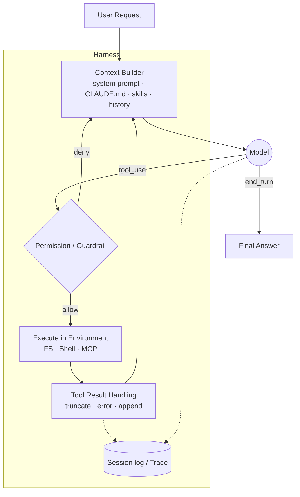

# Buổi 1 — Modern Agent Systems and Harness

> Phần I — Masterclass Agent Engineering · 2 giờ · Buổi mở đầu của 20 buổi
>
> Câu hỏi trung tâm: **"Agent" thực chất là gì, và phần nào trong đó là việc của engineer?**

## 0. Tổng quan

| Hạng mục           | Nội dung                                                                                        |
| ------------------ | ----------------------------------------------------------------------------------------------- |
| Đầu vào            | Học viên biết Python cơ bản, đã từng gọi một LLM API hoặc dùng ChatGPT/Claude                   |
| Đầu ra             | Agent architecture diagram, execution trace có annotate, building-block backlog cho 19 buổi sau |
| Công cụ            | Claude Code (hoặc harness tương đương), `jq`, Python 3.11+, Anthropic SDK                       |
| Project xuyên suốt | Khởi tạo khung **Operations Intelligence Agent** (chỉ ở mức sketch)                             |

### Mục tiêu học tập (đo được)

Sau buổi học, học viên có thể:

1. Phân loại một hệ thống cho trước là **LLM app**, **workflow**, hay **agent** và giải thích bằng tiêu chí "ai quyết định control flow".
2. Liệt kê ít nhất 10 thành phần của harness và chỉ ra thành phần đó nằm ở đâu trong một trace thật.
3. Vẽ agent loop (Observe → Decide → Act → Verify) và nêu 3 termination condition.
4. Đọc một execution trace dạng JSONL, đếm được số turn, tool call, token, cost.
5. Chỉ ra trust boundary giữa agent và environment trong một task cụ thể.
6. Đưa ra lập luận "không nên dùng agent" cho ít nhất một use case.

### Phân bổ thời gian

| Block     | Thời lượng | Nội dung                                                                |
| --------- | ---------- | ----------------------------------------------------------------------- |
| Concept   | 25 phút    | LLM app → workflow → agent; khi nào không dùng agent                    |
| Deep dive | 30 phút    | Agent = Model + Harness; anatomy của loop; environment & trust boundary |
| Demo      | 10 phút    | Instructor chạy Claude Code headless, mở trace, so với raw loop 60 dòng |
| Lab       | 45 phút    | Học viên capture + annotate trace, map thành phần harness               |
| Review    | 10 phút    | Trình bày diagram, chốt building-block backlog                          |

---

## 1. Theory — Từ LLM application đến Agent (25 phút)

### 1.1 Phổ tự chủ (autonomy spectrum)

Tiêu chí phân loại duy nhất cần nhớ: **ai quyết định bước tiếp theo — code hay model?**

| Cấp | Hệ thống                | Control flow do                                    | Ví dụ                                           |
| --- | ----------------------- | -------------------------------------------------- | ----------------------------------------------- |
| 0   | Single LLM call         | Code (1 bước)                                      | Tóm tắt email, phân loại ticket                 |
| 1   | LLM + structured output | Code                                               | Trích xuất JSON từ hóa đơn                      |
| 2   | LLM + 1 lần tool call   | Code quyết định có gọi tool không                  | "Thời tiết hôm nay?" → gọi API 1 lần            |
| 3   | Workflow                | Code định nghĩa đồ thị cố định, LLM chạy từng node | Pipeline dịch → review → format                 |
| 4   | Semi-autonomous agent   | Model quyết định, có human approval ở điểm rủi ro  | Claude Code ở chế độ hỏi quyền                  |
| 5   | Autonomous agent        | Model quyết định toàn bộ trong sandbox             | Coding agent chạy CI, background research agent |

Nhấn mạnh: cấp cao hơn **không tốt hơn**. Mỗi cấp đổi lấy flexibility bằng latency, cost, và khó kiểm chứng.

### 1.2 Các building block của LLM application

- **Inference cơ bản**: input tokens → output tokens. Stateless. Mọi "trí nhớ" đều do caller gửi lại.
- **Chat completion**: danh sách messages có role (`system`, `user`, `assistant`). Conversation state nằm ở client.
- **Structured output**: ép output theo JSON Schema. Biến LLM thành một hàm có kiểu trả về.
- **Tool/function calling**: model không _chạy_ tool. Model chỉ _trả về ý định_ (`tool_use` block với name + arguments). Code của bạn chạy tool và gửi `tool_result` lại. Đây là điểm mấu chốt để hiểu harness.

```python
# Model chỉ "đề xuất" — code quyết định có thực thi hay không
response = client.messages.create(model=MODEL, tools=TOOLS, messages=messages)
for block in response.content:
    if block.type == "tool_use":
        # Đây là chỗ harness chèn validation, permission, sandbox, logging...
        result = execute(block.name, block.input)
```

### 1.3 Năm workflow pattern cơ bản

Theo phân loại của Anthropic trong "Building Effective Agents":

| Pattern                      | Mô tả                                                                  | Dùng khi                                        |
| ---------------------------- | ---------------------------------------------------------------------- | ----------------------------------------------- |
| Prompt chaining (sequential) | Output bước N là input bước N+1, có thể có gate kiểm tra giữa các bước | Task chia được thành các bước cố định           |
| Routing                      | Một LLM call phân loại input rồi chuyển đến handler chuyên biệt        | Input có các loại rõ ràng cần xử lý khác nhau   |
| Parallelization              | Chạy nhiều LLM call song song (sectioning hoặc voting) rồi gộp         | Các subtask độc lập, hoặc cần nhiều góc nhìn    |
| Orchestrator-workers         | LLM trung tâm chia task động rồi giao cho workers                      | Không biết trước số lượng/loại subtask          |
| Evaluator-optimizer          | Một LLM sinh, một LLM đánh giá, lặp đến khi đạt                        | Có tiêu chí đánh giá rõ và lặp cải thiện có ích |

Orchestrator-workers là cầu nối sang agent: số bước bắt đầu do model quyết định.

### 1.4 Agent là gì

Agent = LLM dùng tool **trong một vòng lặp**, dựa trên feedback từ environment, cho đến khi đạt termination condition.

Bốn năng lực phân biệt agent với workflow:

1. **Tự quyết định bước tiếp theo** — không có đồ thị cố định.
2. **Quan sát state/environment** — đọc file, query DB, xem kết quả test.
3. **Chọn tool** — trong tập tool được cấp phép.
4. **Kiểm tra kết quả và lặp** — "test fail → đọc lỗi → sửa → chạy lại".

### 1.5 Khi nào KHÔNG nên dùng agent

Đây là phần quan trọng nhất của 25 phút đầu. Checklist ra quyết định:

| Câu hỏi                                                                 | Nếu "có" →                                         |
| ----------------------------------------------------------------------- | -------------------------------------------------- |
| Các bước có biết trước và ổn định không?                                | Workflow                                           |
| Một LLM call + retrieval có đủ không?                                   | Không cần agent                                    |
| Sai một bước có gây hậu quả không đảo ngược được không?                 | Workflow + human approval, hoặc agent có gate chặt |
| Có yêu cầu latency < 2s không?                                          | Tránh agent loop nhiều turn                        |
| Có cần audit/giải trình từng quyết định cho compliance không?           | Ưu tiên workflow có đường đi xác định              |
| Task mở, số bước không đoán được, cần phản ứng theo kết quả trung gian? | **Agent hợp lý**                                   |

Quy tắc thực hành: bắt đầu từ giải pháp đơn giản nhất, chỉ tăng độ phức tạp khi đo được là cần.

**Câu hỏi thảo luận (3 phút)**: Với Operations Intelligence Agent, liệt kê 3 yêu cầu nên là workflow và 2 yêu cầu thật sự cần agent.

Gợi ý đáp án:

- Workflow: báo cáo KPI hằng ngày (bước cố định), phân loại ticket (routing), dịch tài liệu vận hành.
- Agent: "Vì sao doanh thu khu vực X giảm tuần trước?" (cần khám phá dữ liệu nhiều bước), "Điều tra incident từ log và DB".

---

## 2. Deep dive — Agent = Model + Harness (30 phút)

### 2.1 Định nghĩa

> **Harness là mọi thứ không phải model**: mọi đoạn code, cấu hình và logic thực thi bao quanh LLM, biến nó thành một agent làm được việc.

Model chứa trí thông minh. Harness biến trí thông minh đó thành hành động có kiểm soát. Hai agent dùng **cùng model** có thể cho kết quả rất khác nhau chỉ vì harness khác nhau. Từ đầu 2026, việc thiết kế phần này được gọi là **harness engineering** và là trọng tâm của khóa học.

### 2.2 Bản đồ thành phần harness

Mỗi thành phần gắn với buổi học sẽ xây nó. Đây chính là roadmap của khóa.

| #   | Thành phần                   | Trách nhiệm                                      | Câu hỏi thiết kế                        | Buổi  |
| --- | ---------------------------- | ------------------------------------------------ | --------------------------------------- | ----- |
| 1   | Model                        | Suy luận, sinh token, đề xuất tool call          | Model nào cho bước nào?                 | 1, 18 |
| 2   | System prompt / instructions | Vai trò, policy, output contract                 | Instruction nào luôn có mặt?            | 4     |
| 3   | Context builder              | Chọn và sắp xếp những gì vào context window      | Token budget chia thế nào?              | 4     |
| 4   | Conversation / session state | Lịch sử messages, biến trạng thái                | State nào persist, state nào tạm?       | 2     |
| 5   | Tools                        | Năng lực hành động                               | Tool contract, schema, quyền            | 3     |
| 6   | Tool result handling         | Chuẩn hóa, cắt ngắn, xử lý lỗi của tool          | Kết quả 50k token thì làm gì?           | 3, 4  |
| 7   | Memory                       | Nhớ xuyên session                                | Ghi khi nào, đọc khi nào, xóa thế nào?  | 4     |
| 8   | Skills                       | Module instruction tái sử dụng, nạp theo nhu cầu | Khi nào kích hoạt skill?                | 4     |
| 9   | Retrieval                    | Kéo tri thức ngoài vào context                   | Precision/recall? Tenant filter?        | 5     |
| 10  | Execution environment        | Nơi tool thực sự chạy                            | Filesystem, network, sandbox            | 1, 8  |
| 11  | Guardrails                   | Chặn input/output/tool call nguy hiểm            | Chặn ở lớp nào?                         | 8     |
| 12  | Human approval               | Dừng lại chờ người duyệt                         | Hành động nào cần duyệt?                | 2, 8  |
| 13  | Persistence / checkpoint     | Lưu tiến độ để resume                            | Crash giữa chừng thì sao?               | 2, 19 |
| 14  | Observability                | Trace mọi model call, tool call                  | Làm sao debug một run thất bại?         | 7, 16 |
| 15  | Evaluation                   | Đo chất lượng hành vi                            | Làm sao biết thay đổi không làm tệ hơn? | 7, 17 |
| 16  | Orchestration / subagents    | Chia task cho agent khác                         | Khi nào cần nhiều agent?                | 6     |

### 2.3 Anatomy của một Agent Loop

```text
User Request
    ↓
Build Context            ← harness: system prompt + history + skills + memory + retrieval
    ↓
Model                    ← model: 1 inference call
    ↓
Decision (stop_reason)
 ┌──┴─────────────┐
 │                │
Answer          Tool Call   ← model chỉ đề xuất
 │                ↓
 │             Validate / Permission   ← harness: guardrail, approval
 │                ↓
 │             Execute       ← environment
 │                ↓
 │             Observe       ← harness: chuẩn hóa tool_result, append vào messages
 │                ↓
 └───────→ Model (turn tiếp theo)
              ↓
           Verify            ← model tự kiểm tra hoặc harness chạy verifier
              ↓
            Final
```

Bốn pha của một vòng: **Observe → Decide → Act → Verify**.

Ba điểm dễ bỏ sót:

1. **Tool call thay đổi state.** Sau `write_file`, environment đã khác. Agent phải đọc lại chứ không được "tưởng tượng" kết quả.
2. **Context lớn dần sau mỗi action.** Mỗi `tool_result` được append vào messages. Turn thứ 20 gửi lại toàn bộ 19 turn trước. Đây là gốc rễ của bài toán cost và context (Buổi 4, 18).
3. **Termination là quyết định thiết kế**, không phải mặc định.

### 2.4 Termination conditions

| Loại         | Điều kiện                                                       | Rủi ro nếu thiếu                                           |
| ------------ | --------------------------------------------------------------- | ---------------------------------------------------------- |
| Natural stop | Model trả lời không kèm tool call (`stop_reason == "end_turn"`) | —                                                          |
| Budget stop  | Max turns, max tokens, max cost, wall-clock timeout             | Infinite loop, hóa đơn bất ngờ                             |
| Goal stop    | Verifier xác nhận đạt mục tiêu (test pass, schema hợp lệ)       | Premature termination: model "tuyên bố xong" khi chưa xong |
| Safety stop  | Guardrail chặn, cần human approval                              | Hành động phá hủy không kiểm soát                          |
| Error stop   | Lỗi không phục hồi được, lặp tool call giống hệt nhau N lần     | Agent đập đầu vào tường mãi                                |

Harness production luôn có ít nhất **natural + budget + error stop**.

### 2.5 Agent loop tối giản (≈ 50 dòng)

Đoạn code này là "harness nhỏ nhất có thể". Nó xuất hiện trong demo và là điểm xuất phát của Buổi 2.

```python
# minimal_agent.py — harness tối giản để thấy rõ ranh giới model/harness
import json, subprocess
from anthropic import Anthropic

client = Anthropic()
MODEL = "claude-sonnet-5"
MAX_TURNS = 10  # budget stop

TOOLS = [{
    "name": "run_shell",
    "description": "Chạy một lệnh shell read-only trong thư mục làm việc. Trả về stdout/stderr.",
    "input_schema": {
        "type": "object",
        "properties": {"command": {"type": "string"}},
        "required": ["command"],
    },
}]

ALLOWED_PREFIXES = ("ls", "cat", "grep", "wc", "head")  # guardrail thô sơ

def run_shell(command: str) -> str:
    if not command.startswith(ALLOWED_PREFIXES):
        return "ERROR: command not allowed"          # tool result handling: lỗi có ngữ nghĩa
    out = subprocess.run(command, shell=True, capture_output=True, text=True, timeout=10)
    return (out.stdout + out.stderr)[:4000]          # cắt ngắn để bảo vệ context

def agent(task: str) -> str:
    messages = [{"role": "user", "content": task}]   # session state
    for turn in range(MAX_TURNS):
        resp = client.messages.create(
            model=MODEL, max_tokens=1024,
            system="Bạn là agent phân tích repo. Dùng tool để kiểm chứng trước khi trả lời.",
            tools=TOOLS, messages=messages,
        )
        print(f"[turn {turn}] stop={resp.stop_reason} in={resp.usage.input_tokens} out={resp.usage.output_tokens}")
        messages.append({"role": "assistant", "content": resp.content})
        if resp.stop_reason != "tool_use":           # natural stop
            return "".join(b.text for b in resp.content if b.type == "text")
        results = []
        for block in resp.content:
            if block.type == "tool_use":
                print(f"  tool_use {block.name} {json.dumps(block.input)}")
                results.append({"type": "tool_result", "tool_use_id": block.id,
                                "content": run_shell(**block.input)})
        messages.append({"role": "user", "content": results})  # observe
    return "STOPPED: max turns reached"              # budget stop

if __name__ == "__main__":
    print(agent("Repo này có bao nhiêu file Markdown và file nào dài nhất?"))
```

Chỉ cho học viên thấy: dòng nào là model (`client.messages.create`), mọi dòng còn lại là harness. Thiếu gì so với production: persistence, streaming, retry, sandbox thật, auth, observability, eval. Đó là 19 buổi còn lại.

> `shell=True` + prefix allowlist **không phải** sandbox an toàn (`cat x; rm -rf ~` vẫn bắt đầu bằng `cat`). Để nguyên lỗ hổng này làm câu hỏi mồi cho Buổi 3 và Buổi 8.

### 2.6 Execution environment và trust boundary

Environment là nơi tool thực sự tác động. Agent không "chạm" vào thế giới; harness chạm thay nó.

| Environment       | Tool điển hình        | Side effect                | Rủi ro chính                           |
| ----------------- | --------------------- | -------------------------- | -------------------------------------- |
| Filesystem        | read/write/edit file  | Có                         | Ghi đè, xóa, đọc secret (`.env`)       |
| Database          | SQL query             | Có nếu write               | `DROP`, rò rỉ dữ liệu tenant khác      |
| APIs              | HTTP call             | Có                         | Gọi API tốn tiền, gửi dữ liệu ra ngoài |
| Browser           | navigate, click       | Có                         | Nội dung web chứa prompt injection     |
| Sandbox           | chạy code             | Cô lập                     | Thoát sandbox, dùng hết tài nguyên     |
| External services | email, Slack, payment | Có, thường không đảo ngược | Hành động công khai, mất tiền          |

**Trust boundary** là ranh giới mà dữ liệu đi qua phải được coi là không tin cậy:

```text
┌───────────────── Trusted (do bạn kiểm soát) ─────────────────┐
│  System prompt · Harness code · Tool allowlist · Policy       │
└──────────────────────────┬───────────────────────────────────┘
                           │  ← boundary 1: user input
┌──────────────────────────▼───────────────────────────────────┐
│  Model output (tool_use)  — KHÔNG tin cậy tuyệt đối           │
│  → validate schema, kiểm quyền, approval trước khi execute    │
└──────────────────────────┬───────────────────────────────────┘
                           │  ← boundary 2: tool execution
┌──────────────────────────▼───────────────────────────────────┐
│  Environment: file, web page, DB row, API response            │
│  → tool_result có thể chứa instruction độc hại                │
└──────────────────────────────────────────────────────────────┘
```

Nguyên tắc cốt lõi mang theo cả khóa: **model output là đề xuất, tool result là dữ liệu, không cái nào là lệnh.**

### 2.7 Case study (so sánh conceptually)

| Tiêu chí         | Claude Code                                         | ChatGPT agent / agentic workflows    | Cursor                            |
| ---------------- | --------------------------------------------------- | ------------------------------------ | --------------------------------- |
| Loại agent       | Coding agent, terminal-first                        | General-purpose, browser + tools     | Coding agent, IDE-first           |
| Environment      | Local filesystem + shell của user                   | Sandbox/VM phía cloud, browser ảo    | Workspace trong IDE, terminal     |
| Tool chính       | Read, Edit, Write, Bash, Grep, Task (subagent), MCP | Browse, code interpreter, connectors | Edit, codebase search, terminal   |
| Context strategy | CLAUDE.md, skills nạp theo nhu cầu, auto-compact    | Memory người dùng, file upload       | Codebase index (embedding), rules |
| Human approval   | Permission mode theo tool/lệnh, hooks               | Xác nhận trước hành động nhạy cảm    | Duyệt diff, chạy lệnh             |
| Extensibility    | MCP, hooks, skills, subagents, SDK                  | Connectors/Apps                      | MCP, rules                        |

Cùng một vòng lặp, khác nhau ở **environment, tool, context strategy và approval policy**. Đó đều là quyết định harness.

Ba loại agent học viên sẽ gặp:

|                | Coding agent                           | Research agent               | Operations agent                                |
| -------------- | -------------------------------------- | ---------------------------- | ----------------------------------------------- |
| Goal check     | Có oracle mạnh: test, compiler, linter | Yếu: cần citation + verifier | Trung bình: số liệu đối chiếu được              |
| Side effect    | Cao (ghi file, chạy lệnh)              | Thấp (chủ yếu đọc)           | Thay đổi tùy tool (read-only DB vs gọi API)     |
| Rủi ro chính   | Phá repo, chạy lệnh nguy hiểm          | Hallucination, nguồn kém     | Rò rỉ dữ liệu, hành động sai trên hệ thống thật |
| Trong khóa này | Harness ta dùng để học                 | Buổi 5–6                     | **Project xuyên suốt**                          |

---

## 3. Demo — Instructor (10 phút)

Mục tiêu: cùng một task, xem hai harness chạy — một harness production (Claude Code) và harness 50 dòng ở mục 2.5.

**Bước 1** — chạy Claude Code headless, xuất trace dạng NDJSON:

```bash
mkdir -p traces
claude -p "Repo này có bao nhiêu file Markdown và file nào dài nhất?" \
  --output-format stream-json --verbose \
  --allowedTools "Read,Grep,Glob,Bash(wc:*),Bash(ls:*)" \
  > traces/demo.jsonl
```

**Bước 2** — mổ xẻ trace bằng `jq`:

```bash
# Harness khai báo gì lúc khởi động? (tool discovery, model, permission mode, MCP)
jq -c 'select(.type=="system" and .subtype=="init") | {model, permissionMode, tools, mcp_servers}' traces/demo.jsonl

# Model đã gọi những tool nào, với argument gì?
jq -c 'select(.type=="assistant") | .message.content[] | select(.type=="tool_use") | {name, input}' traces/demo.jsonl

# Tool result nào bị lỗi?
jq -c 'select(.type=="user") | .message.content[]? | select(.type=="tool_result") | {tool_use_id, is_error}' traces/demo.jsonl

# Tổng kết run: số turn, thời gian, cost, token (chú ý cache_read_input_tokens)
jq -c 'select(.type=="result") | {subtype, num_turns, duration_ms, total_cost_usd, usage}' traces/demo.jsonl
```

**Bước 3** — chạy `python minimal_agent.py` với cùng câu hỏi, so sánh:

- Số turn và số tool call khác nhau thế nào?
- Claude Code có những tool nào mà ta không cấp? System prompt của nó lớn cỡ nào (nhìn `input_tokens` turn đầu)?
- `cache_read_input_tokens` cho thấy harness đang dùng prompt caching. Harness 50 dòng chưa làm (Buổi 18).

> Tên field trong stream-json có thể thay đổi theo version. Chạy `claude --version` và kiểm tra lại trước buổi học.

---

## 4. Lab — Explore một agent harness có sẵn (45 phút)

### 4.1 Chuẩn bị (làm trước buổi học)

- Cài Claude Code, đăng nhập được. Kiểm tra: `claude --version`.
- Cài `jq`, Python 3.11+, `pip install anthropic`, có `ANTHROPIC_API_KEY`.
- Clone repo mẫu của khóa (hoặc dùng một repo nhỏ bất kỳ < 50 file) làm environment.
- Lưu ý chi phí: mỗi task lab thường tốn dưới 0,5 USD. Đặt budget cho API key.

### 4.2 Các bước

| Bước                | Việc làm                                                                    | Quan sát gì                              | Ghi vào               |
| ------------------- | --------------------------------------------------------------------------- | ---------------------------------------- | --------------------- |
| 1. Gửi task         | Chọn 1 trong 3 task ở 4.3, chạy với `--output-format stream-json --verbose` | —                                        | `traces/task-X.jsonl` |
| 2. Model invocation | Đếm số event `assistant`; ghi `model`, `usage` từng turn                    | Input tokens tăng dần theo turn          | Bảng trace            |
| 3. Tool discovery   | Đọc event `system/init`: `tools`, `mcp_servers`                             | Tool nào có sẵn trước khi model nghĩ     | Bảng harness          |
| 4. Tool call        | Liệt kê mọi `tool_use` với `name` + `input`                                 | Model chọn tool nào, vì sao              | Bảng trace            |
| 5. Tool result      | Ghép `tool_use_id` với `tool_result`, xem `is_error`                        | Kết quả dài/ngắn, lỗi được xử lý thế nào | Bảng trace            |
| 6. Context thay đổi | Vẽ `input_tokens` theo turn                                                 | Context phình ra ở đâu                   | Biểu đồ/ghi chú       |
| 7. Termination      | Đọc event `result`: `subtype`, `num_turns`, `total_cost_usd`                | Dừng vì lý do gì trong 5 loại ở 2.4      | Bảng trace            |
| 8. Map harness      | Với mỗi dòng trace, gắn nhãn thành phần ở bảng 2.2                          | Phần nào là model, phần nào là harness   | Diagram               |

**Thí nghiệm bắt buộc (bước 8b)**: chạy lại cùng task nhưng bỏ bớt quyền, ví dụ `--allowedTools "Read"`. Quan sát agent thích nghi, thất bại, hay hỏi quyền. Đây là bằng chứng trực tiếp rằng **harness định hình hành vi** dù model không đổi.

### 4.3 Task gợi ý

| Task                                                                  | Loại           | Điều thú vị cần quan sát                             |
| --------------------------------------------------------------------- | -------------- | ---------------------------------------------------- |
| A. "Tìm tất cả TODO trong repo, nhóm theo file, đề xuất thứ tự xử lý" | Read-only      | Chiến lược tìm kiếm: Grep một lần hay đọc từng file? |
| B. "Viết unit test cho hàm X và chạy cho đến khi pass"                | Có side effect | Vòng Verify: chạy test → đọc lỗi → sửa → chạy lại    |
| C. "Tóm tắt cấu trúc repo thành một sơ đồ"                            | Mở             | Termination: khi nào model cho rằng "đủ"?            |

Học viên làm nhanh: làm cả A và B rồi so sánh trajectory.

### 4.4 Template annotate trace

```markdown
| Turn | Event                | Nội dung tóm tắt                        | Thành phần harness         | Tokens in/out | Ghi chú                         |
| ---- | -------------------- | --------------------------------------- | -------------------------- | ------------- | ------------------------------- |
| 0    | system/init          | 12 tools, 1 MCP, permissionMode=default | Tool registry, Permission  | —             |                                 |
| 1    | assistant → tool_use | Grep "TODO"                             | Model → Tool call          | 8.2k / 120    | Chọn Grep thay vì đọc từng file |
| 1    | user → tool_result   | 34 dòng match                           | Tool result handling       | —             | Không lỗi                       |
| 2    | ...                  |                                         |                            |               |                                 |
| N    | result               | success, 5 turns, $0.08                 | Termination (natural stop) |               |                                 |
```

### 4.5 Script hỗ trợ (tùy chọn)

```python
# summarize_trace.py — in bảng tóm tắt từ trace stream-json
import json, sys

turn = 0
for line in open(sys.argv[1]):
    ev = json.loads(line)
    t = ev.get("type")
    if t == "system" and ev.get("subtype") == "init":
        print(f"INIT model={ev.get('model')} tools={len(ev.get('tools', []))}")
    elif t == "assistant":
        turn += 1
        u = ev["message"].get("usage", {})
        for b in ev["message"]["content"]:
            if b["type"] == "tool_use":
                print(f"T{turn} TOOL_USE {b['name']} {json.dumps(b['input'])[:80]}")
            elif b["type"] == "text":
                print(f"T{turn} TEXT {b['text'][:80]!r}")
        print(f"T{turn}   usage in={u.get('input_tokens')} cache_read={u.get('cache_read_input_tokens')} out={u.get('output_tokens')}")
    elif t == "user":
        for b in ev["message"].get("content", []):
            if isinstance(b, dict) and b.get("type") == "tool_result":
                print(f"T{turn} TOOL_RESULT error={b.get('is_error', False)}")
    elif t == "result":
        print(f"RESULT {ev.get('subtype')} turns={ev.get('num_turns')} "
              f"cost=${ev.get('total_cost_usd')} ms={ev.get('duration_ms')}")
```

Chạy: `python summarize_trace.py traces/task-A.jsonl`

---

## 5. Output — Deliverables

### 5.1 Agent architecture diagram

Yêu cầu: vẽ harness đã quan sát (Mermaid, Excalidraw, hoặc giấy). Phải có:

- Model tách biệt rõ với harness.
- Ít nhất 8 thành phần từ bảng 2.2, gắn nhãn cái nào **quan sát được trong trace** và cái nào **suy luận**.
- Hai trust boundary ở mục 2.6.
- Mũi tên của loop Observe → Decide → Act → Verify.

Mẫu khởi đầu:



### 5.2 Execution trace annotated

- File `traces/task-X.jsonl` gốc.
- Bảng annotate theo template 4.4, đủ mọi turn.
- 3 câu trả lời ngắn:
  1. Run dừng theo loại termination nào?
  2. Tool call nào thừa hoặc có thể tối ưu?
  3. Khi bỏ quyền (bước 8b), hành vi thay đổi ra sao?

### 5.3 Building-block backlog cho 19 buổi

Chuyển bảng 2.2 thành backlog của **Operations Intelligence Agent**. Mỗi dòng: thành phần · buổi xây · tiêu chí "xong" · rủi ro nếu thiếu.

```markdown
| Thành phần                 | Buổi | Definition of done                | Rủi ro nếu thiếu             |
| -------------------------- | ---- | --------------------------------- | ---------------------------- |
| Stateful loop + checkpoint | 2    | Resume được sau khi kill process  | Mất tiến độ task dài         |
| Read-only SQL tool qua MCP | 3    | Có auth, allowlist, audit log     | Agent chạy query phá dữ liệu |
| Context builder + memory   | 4    | Token budget, tách namespace user | Rò rỉ context giữa user      |
| ...                        |      |                                   |                              |
```

---

## 6. Review (10 phút)

- 2–3 học viên trình bày diagram. Cả lớp tìm thành phần bị thiếu.
- Chốt: harness quyết định agent **được phép** làm gì, **thấy** gì, **dừng** khi nào, và **ghi lại** gì.

### Câu hỏi kiểm tra cuối buổi

1. Tool calling có nghĩa là model chạy tool không? Nếu không thì ai chạy?
2. Vì sao turn thứ 10 tốn nhiều input token hơn turn thứ 1?
3. Nêu một task mà workflow tốt hơn agent, giải thích bằng tiêu chí của mục 1.5.
4. `stop_reason == "end_turn"` có đảm bảo task đã hoàn thành đúng không? Cần thêm gì?
5. Trong `minimal_agent.py`, chỉ ra một lỗ hổng bảo mật và cho biết nó thuộc trust boundary nào.

### Theo 4 câu hỏi của khóa

| Câu hỏi   | Trả lời cho Buổi 1                                                                                                       |
| --------- | ------------------------------------------------------------------------------------------------------------------------ |
| Why?      | Model một mình không hành động được và không an toàn khi hành động. Harness biến inference thành công việc có kiểm soát. |
| How?      | Vòng lặp messages + tool_use/tool_result, bao quanh bởi context builder, permission, execution, logging.                 |
| Failure?  | Infinite loop, premature stop, tool call nguy hiểm, context phình, injection từ tool result.                             |
| Evidence? | Execution trace: đếm turn, tool call, token, cost, lý do dừng.                                                           |

---

## 7. Chuẩn bị cho Buổi 2

- Đọc lại `minimal_agent.py`, liệt kê những gì sẽ mất nếu process bị kill ở turn 5.
- Cài `langgraph` và đọc trước phần concept State / Node / Edge / Checkpoint.
- Mang theo backlog 5.3: Buổi 2 hiện thực dòng đầu tiên (stateful loop + checkpoint).

## 8. Tài liệu tham khảo

- [Anthropic — Building Effective AI Agents](https://www.anthropic.com/engineering/building-effective-agents): phân loại workflow vs agent, 5 pattern.
- [Claude Cookbook — Basic workflows](https://platform.claude.com/cookbook/patterns-agents-basic-workflows): code mẫu cho các pattern.
- [LangChain — The Anatomy of an Agent Harness](https://www.langchain.com/blog/the-anatomy-of-an-agent-harness): định nghĩa "Agent = Model + Harness".
- [Harness Engineering: Anatomy, Architecture, and Evolution of Coding Agents (arXiv 2609.00006)](https://arxiv.org/html/2609.00006): nghiên cứu source code 11 coding agent.
- [Databricks — What is an AI Agent Harness?](https://www.databricks.com/blog/ai-harness)
- [Claude Code — Headless mode](https://docs.anthropic.com/en/docs/claude-code/sdk/sdk-headless): `-p`, `--output-format stream-json`.
- [cc-wrap — Claude stream-json event reference](https://github.com/badlogic/cc-wrap/blob/main/docs/claude-stream-json.md): cấu trúc event `system`, `assistant`, `user`, `result`.
