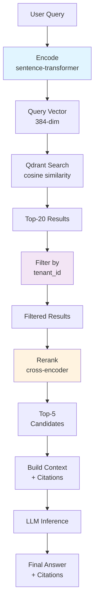

# Buổi 5 — Advanced Retrieval and Vector Databases

> Phần I — Masterclass Agent Engineering · 2 giờ · Buổi 5/20
>
> Câu hỏi trung tâm: **Làm sao agent truy cập kiến thức ngoài model context một cách hiệu quả và an toàn?**

## 0. Tổng quan

| Hạng mục           | Nội dung                                                                                               |
| ------------------ | ------------------------------------------------------------------------------------------------------ |
| Đầu vào            | Hoàn thành Buổi 4 (context engineering), hiểu embeddings cơ bản, đã dùng LangGraph                     |
| Đầu ra             | Retrieval tool có Qdrant backend, metadata filtering, tenant isolation, source citations, eval metrics |
| Công cụ            | Qdrant (in-memory hoặc Docker), sentence-transformers, Anthropic SDK, LangGraph, Python 3.11+          |
| Project xuyên suốt | Nâng cấp Operations Intelligence Agent: thêm RAG pipeline, retrieve từ knowledge base, trả citation    |

### Mục tiêu học tập (đo được)

Sau buổi học, học viên có thể:

1. Giải thích RAG architecture và vị trí của retrieval trong agent loop.
2. Thiết kế chunking strategy cho document type cụ thể (PDF, code, SQL schema).
3. Tính embedding dimension, similarity metric và explain trade-offs (speed vs. accuracy).
4. Xây Qdrant collection với payload metadata, index config, filter criteria.
5. Implement query expansion hoặc multi-query để cải thiện recall.
6. Đo retrieval quality bằng precision@k, recall, source coverage.
7. Implement tenant filtering để chặn cross-tenant data leakage.
8. Generate citations từ retrieved sources, integrate vào agent context.
9. Debug retrieval miss và apply reranking hoặc context compression.

### Phân bổ thời gian

| Block     | Thời lượng | Nội dung                                                              |
| --------- | ---------- | --------------------------------------------------------------------- |
| Concept   | 20 phút    | RAG architecture, embeddings, chunking strategy cơ bản                |
| Deep dive | 30 phút    | Qdrant schema, retrieval quality metrics, tenant isolation, reranking |
| Demo      | 15 phút    | Instructor xây Qdrant collection, ingest, query, show miss case       |
| Lab       | 45 phút    | Học viên xây full retrieval tool: ingest → query → filter → citation  |
| Review    | 10 phút    | Demo retrieval, trace quality, chốt eval framework cho production     |

---

## 1. Theory — RAG Architecture và Embeddings (20 phút)

### 1.1 Vì sao cần retrieval

Ở Buổi 4, context builder chỉ có fixed context: system prompt, chat history, memory. Nhưng:

- Knowledge base có thể lớn hơn model context window 100 lần.
- User hỏi về dữ liệu mới được thêm vào hôm nay, mà model training cutoff 6 tháng trước.
- Tool result từ API quá dài (50k token), cần lọc chỉ phần liên quan.

**Retrieval** là cơ chế kéo thông tin liên quan vào context **tại query time**, không phải build-time.

RAG = **Retrieval-Augmented Generation**: trước khi gọi LLM, agent lấy tài liệu có liên quan và đưa vào context.

```text
User Query
    ↓
Query Encoder
    ↓
Vector Space
    ↓
Similarity Search → Top-k Documents
    ↓
Reranking / Filtering
    ↓
Context Building
    ↓
LLM Inference
    ↓
Response + Citations
```

Ví dụ: user hỏi "Doanh thu Q3 2024 của khu vực Asia là bao nhiêu?"

Không cần agent:

1. Tìm doc: "2024 Regional Quarterly Reports"
2. Đọc page 45
3. Nhớ con số chính xác
4. Trích ra

Với RAG:

1. Encode query thành vector
2. Tìm doc trong vector DB có similarity cao nhất
3. Lấy chunk đó + 2 chunks xung quanh (context)
4. Truyền vào context
5. LLM chỉ cần extract, không nhớ

**Trade-off**: latency + retrieval cost, nhưng giảm hallucination và đảm bảo freshness.

### 1.2 Embeddings: từ text thành vector

Embedding = một vector số thực ~384-4096 chiều, đại diện semantic của text. Hai text ngữ nghĩa giống nhau → vectors gần nhau trong không gian.

**Embedding model** ánh xạ text → vector. Ví dụ: sentence-transformers/all-MiniLM-L6-v2 (384 dims).

```python
from sentence_transformers import SentenceTransformer

model = SentenceTransformer("all-MiniLM-L6-v2")
embedding1 = model.encode("Doanh thu Q3 2024")     # [0.12, -0.45, ..., 0.08]  (384 dims)
embedding2 = model.encode("Cô ấy bán hàng tốt")     # [0.11, -0.46, ..., 0.09]
# Tương tự nhưng không giống hệt nhau
```

**Similarity metrics** (so sánh 2 vectors):

| Metric         | Công thức                    | Range  | Dùng khi                      |
| -------------- | ---------------------------- | ------ | ----------------------------- |
| Cosine         | dot(a,b) / (norm(a)*norm(b)) | [0,1]  | Chuẩn de facto cho embeddings |
| Euclidean (L2) | sqrt(sum((a-b)²))            | [0,∞)  | Distance-based (ít dùng)      |
| Dot product    | dot(a,b)                     | (-∞,∞) | Nếu vectors đã normalized     |

Qdrant dùng cosine mặc định.

**Dimension trade-off**:

- 96 dims: rất nhanh, nhưng semantic khó phân biệt.
- 384 dims: cân bằng tốt (sentence-transformers).
- 1536 dims: OpenAI text-embedding-3-small, chi phí cao hơn.
- 3072 dims: text-embedding-3-large, rất chính xác nhưng tối ưu chỉ ở truy vấn đặc biệt.

Quy tắc: bắt đầu từ 384, tuning dựa vào eval kết quả.

### 1.3 Chunking: chia document thành fragments

Document gốc (ví dụ PDF 50 trang) quá dài để embed trực tiếp. Phải chia thành **chunks** nhỏ (~256-512 tokens, tương đương 1-2 đoạn text).

**Chunking strategy** quyết định quality retrieval:

| Strategy        | Quy tắc                                     | Ưu điểm                          | Nhược điểm                  |
| --------------- | ------------------------------------------- | -------------------------------- | --------------------------- |
| Fixed size      | Luôn 256 tokens, overlap 50 tokens          | Đơn giản, nhanh                  | Đứt context giữa câu        |
| Recursive       | Chia theo "\n\n" → "\n" → " ", nếu vẫn dài  | Giữ context tốt                  | Phức tạp, overlap phải tính |
| Semantic        | Embed từng sentence, merge nếu cosine > 0.8 | Semantic boundary rõ ràng        | Chậm (phải encode toàn bộ)  |
| Structure-aware | Nhận biết heading, list, table, code block  | Output có cấu trúc, easy to cite | Cần parser từng file type   |

Ví dụ fixed-size chunking:

```python
def chunk_fixed_size(text: str, chunk_size=256, overlap=50):
    tokens = text.split()
    chunks = []
    for i in range(0, len(tokens), chunk_size - overlap):
        chunk = " ".join(tokens[i : i + chunk_size])
        chunks.append(chunk)
    return chunks

# Nếu text = "A B C ... Z" (1000 tokens)
# → chunks = [A...L (256), G...Q (256), L...Z (remaining)]
# G, L là overlap
```

**Metadata attachment**: mỗi chunk cần lưu source:

```python
chunk_with_metadata = {
    "text": "Doanh thu Q3 2024 là...",
    "source": "2024_regional_reports.pdf",
    "page": 45,
    "section": "Asia Region",
    "file_id": "doc_12345",
    "timestamp": "2024-09-27",
}
```

Metadata này sẽ được filter trong query time (Buổi này gọi "payload" trong Qdrant).

---

## 2. Deep dive — Qdrant, Retrieval Quality, Multi-tenant (30 phút)

### 2.1 Qdrant fundamentals

Qdrant là vector database. Nó lưu:

- **Vector**: embedding (384-3072 dims)
- **Payload**: metadata JSON (source, page, tenant_id, ...)
- **Index**: cấu trúc dữ liệu tối ưu hóa similarity search (HNSW, IVF, PQ, ...)

Basic API:

```python
from qdrant_client import QdrantClient
from qdrant_client.models import Distance, VectorParams, PointStruct

client = QdrantClient(":memory:")  # In-memory, hoặc "http://localhost:6333" cho server

# 1. Tạo collection
client.create_collection(
    collection_name="documents",
    vectors_config=VectorParams(size=384, distance=Distance.COSINE),
)

# 2. Insert points (vectors + payloads)
client.upsert(
    collection_name="documents",
    points=[
        PointStruct(
            id=1,
            vector=[0.12, -0.45, ..., 0.08],  # embedding
            payload={
                "text": "Doanh thu Q3 2024 là...",
                "source": "report.pdf",
                "page": 45,
                "tenant_id": "org_001",
            }
        ),
        # ... more points
    ]
)

# 3. Search
results = client.search(
    collection_name="documents",
    query_vector=[0.11, -0.46, ..., 0.09],  # query embedding
    limit=5,  # top-5
    query_filter={  # Optional: filter payload
        "must": [{"key": "tenant_id", "match": {"value": "org_001"}}]
    }
)

# results = [
#   SearchResult(id=1, score=0.95, payload={...}),
#   SearchResult(id=3, score=0.87, payload={...}),
#   ...
# ]
```

**Collection schema**:

```python
# Index config — ảnh hưởng speed vs. accuracy
vectors_config = VectorParams(
    size=384,
    distance=Distance.COSINE,
    on_disk=False,  # True = lưu disk, chậm hơn nhưng dùng RAM ít
)

# Payload index — filter nhanh
client.create_payload_index(
    collection_name="documents",
    field_name="tenant_id",
    field_type="keyword",  # dạng categorical
)

client.create_payload_index(
    collection_name="documents",
    field_name="timestamp",
    field_type="integer",
)
```

### 2.2 Retrieval Quality Metrics

Làm sao biết retrieval tốt hay không? Cần eval dataset.

**Eval dataset** = list (query, ground_truth_docs, expected_answer):

```python
eval_cases = [
    {
        "query": "Doanh thu Q3 2024 khu vực Asia là bao nhiêu?",
        "ground_truth_doc_ids": [1, 3, 5],  # chỉ 3 doc này chứa đáp án đúng
        "expected_answer": "100 triệu USD",
    },
    {
        "query": "Quy trình onboarding nhân viên là gì?",
        "ground_truth_doc_ids": [12],
        "expected_answer": "...",
    },
    # ...
]
```

**Metrics**:

| Metric                                         | Định nghĩa                         | Formula                        | Mục tiêu |
| ---------------------------------------------- | ---------------------------------- | ------------------------------ | -------- |
| Precision@k                                    | % top-k kết quả là relevant        | relevant_in_top_k / k          | > 80%    |
| Recall@k                                       | % ground_truth docs được retrieve  | retrieved / total_ground_truth | > 90%    |
| MRR (Mean Reciprocal Rank)                     | Trung bình 1/(vị trí doc đầu tiên) | avg(1 / first_relevant_rank)   | > 0.8    |
| NDCG@k (Normalized Discounted Cumulative Gain) | Rank-aware relevance               | — (dùng thư viện)              | > 0.75   |

Thực tế, với agent, chỉ cần **Precision@5** (top-5 kết quả có bao nhiêu % relevant).

**Failure case**: "Missing knowledge"

Nếu document không có trong knowledge base → retrieval không thể tìm được, dù query đúng. Ví dụ:

- User hỏi về event chưa xảy ra (future knowledge)
- Internal policy được thay đổi nhưng chưa update knowledge base
- Feature mới của product chưa có doc

Cách xác định: kỹ sư review LLM output, nếu sai → check retrieval result. Nếu retrieval empty hoặc low score → **missing knowledge**.

### 2.3 Advanced Retrieval Techniques

Khi Precision@5 < 80%, cần apply kỹ thuật nâng cao.

#### A. Metadata Filtering + Hybrid Retrieval

Giả sử query "Doanh thu Q3 2024 Asia", mình biết nó trong report của Asia region. Có thể filter **payload**:

```python
results = client.search(
    collection_name="documents",
    query_vector=encoded_query,
    limit=5,
    query_filter={
        "must": [
            {"key": "section", "match": {"value": "Asia Region"}},
            {"key": "year", "match": {"value": 2024}},
        ]
    }
)
```

Giảm recall nhưng tăng precision (bỏ doc không liên quan).

**Hybrid retrieval** = semantic search + keyword search:

```python
# Semantic: vector similarity
semantic_results = client.search(
    collection_name="documents",
    query_vector=encoded_query,
    limit=10,
)

# Keyword: bm25 / full-text
keyword_results = full_text_search(query, collection)

# Merge và rerank
merged = merge_results_by_id(semantic_results, keyword_results)
final = rerank(merged, query)[:5]
```

#### B. Query Expansion / Multi-Query

Model yếu: chỉ encode query nhu là lần đầu. Nhưng query có thể mơ hồ.

Ví dụ: user hỏi "Chi phí vận hành hôm nay".

- Query 1: "operating cost"
- Query 2: "daily expenses"
- Query 3: "capex vs opex"

LLM sinh ra 3 query → search cả 3 → merge results → top-5.

```python
def expand_query(query: str, llm) -> list[str]:
    prompt = f"""Sinh 3 query cần search để trả lời: "{query}"
    Mỗi query nên khác góc độ / từ khóa.
    Trả lại JSON array: ["query1", "query2", "query3"]"""

    response = llm.generate(prompt)
    expanded = json.loads(response)
    return [query] + expanded  # 4 queries total

queries = expand_query("Chi phí vận hành hôm nay", llm)
all_results = []
for q in queries:
    results = client.search(
        collection_name="documents",
        query_vector=encode(q),
        limit=5,
    )
    all_results.extend(results)

# Dedup by ID + rerank
final = rerank_and_dedup(all_results, original_query)[:5]
```

#### C. Reranking

Top-k vector search nhanh nhưng không perfect. **Reranker** là model nhỏ học xếp hạng cặp (query, document).

```python
from sentence_transformers import CrossEncoder

reranker = CrossEncoder('cross-encoder/qnli-distilroberta-base')

# Sau vector search lấy top-20
candidates = client.search(
    collection_name="documents",
    query_vector=encoded_query,
    limit=20,
)

# Rerank
scores = reranker.predict([(query, doc.payload["text"]) for doc in candidates])
candidates_with_rerank_score = list(zip(candidates, scores))
candidates_with_rerank_score.sort(key=lambda x: x[1], reverse=True)

# Lấy top-5 sau rerank
final = [doc for doc, score in candidates_with_rerank_score[:5]]
```

Trade-off: thêm latency (rerank model inference), nhưng precision@5 tăng 15-20%.

### 2.4 Multi-tenant Retrieval — Ngăn Cross-tenant Leakage

Operations Intelligence Agent dùng chung, nhưng mỗi org chỉ được thấy doc của mình.

**Threat**: user từ org_A query, retrieval nhầm trả doc từ org_B.

**Defense**: tenant filtering ở retrieval time.

```python
# Query builder
def retrieve_for_tenant(query: str, tenant_id: str, limit=5):
    encoded_query = encode(query)

    results = client.search(
        collection_name="documents",
        query_vector=encoded_query,
        limit=limit,
        query_filter={
            "must": [
                {"key": "tenant_id", "match": {"value": tenant_id}}
            ]
        }
    )
    return results
```

**Ngăn chặn**:

1. Filter ở query time (trên).
2. Index tenant_id: `client.create_payload_index(..., field_name="tenant_id", ...)` → search nhanh.
3. Audit: log mỗi query + tenant_id + returned docs.
4. Backup: separate collections per tenant (nếu data size lớn).

### 2.5 Source Citations

User hỏi "Doanh thu Q3 2024 Asia là bao nhiêu?", LLM trả "100 triệu USD". Cần cite source.

Retrieved doc có payload `{"source": "2024_regional_reports.pdf", "page": 45}`. Truyền vào context:

```python
# Build context
retrieved_docs = retrieve_for_tenant(query, tenant_id)

context_with_sources = "Thông tin liên quan:\n"
for i, doc in enumerate(retrieved_docs, 1):
    source = doc.payload.get("source", "unknown")
    page = doc.payload.get("page", "")
    context_with_sources += f"[{i}] ({source}, trang {page}): {doc.payload['text']}\n"

# Instruction cho LLM
system_prompt = f"""
Trả lời câu hỏi dựa trên thông tin dưới.
Khi trích dẫn thông tin, ghi rõ [số], ví dụ: "Doanh thu là 100 triệu [1]".

{context_with_sources}
"""

response = llm.generate(
    system=system_prompt,
    user_message=query
)
# LLM output: "Doanh thu Q3 2024 Asia là 100 triệu USD [1]."
# [1] = 2024_regional_reports.pdf, trang 45
```

---

## 3. Demo — Instructor (15 phút)

Mục tiêu: từ 0 → Qdrant collection, ingest, retrieve, observe miss case.

### Bước 1: Setup Qdrant in-memory

```bash
pip install qdrant-client sentence-transformers
```

```python
# demo_qdrant_setup.py
from qdrant_client import QdrantClient
from qdrant_client.models import Distance, VectorParams, PointStruct
from sentence_transformers import SentenceTransformer

# Init
client = QdrantClient(":memory:")
encoder = SentenceTransformer("all-MiniLM-L6-v2")

# Create collection
client.create_collection(
    collection_name="docs",
    vectors_config=VectorParams(size=384, distance=Distance.COSINE),
)

print("✓ Collection created")
```

Chạy: `python demo_qdrant_setup.py`

### Bước 2: Ingest sample documents

```python
# demo_ingest.py
documents = [
    {
        "id": 1,
        "text": "Doanh thu Q3 2024 khu vực Asia là 100 triệu USD",
        "source": "2024_regional_report.pdf",
        "page": 45,
        "section": "Asia",
    },
    {
        "id": 2,
        "text": "Doanh thu Q3 2024 khu vực Europe là 80 triệu USD",
        "source": "2024_regional_report.pdf",
        "page": 46,
        "section": "Europe",
    },
    {
        "id": 3,
        "text": "Quy trình onboarding nhân viên mất 2 tuần, bao gồm training, setup tools",
        "source": "hr_handbook.pdf",
        "page": 12,
        "section": "HR",
    },
    {
        "id": 4,
        "text": "API key nên rotate hàng tháng. Secret nên lưu trong Secret Manager",
        "source": "security_policy.pdf",
        "page": 5,
        "section": "Security",
    },
]

points = [
    PointStruct(
        id=doc["id"],
        vector=encoder.encode(doc["text"]).tolist(),
        payload={k: v for k, v in doc.items() if k != "id" and k != "text"}
    )
    for doc in documents
]

client.upsert(collection_name="docs", points=points)
print(f"✓ Ingested {len(points)} documents")
```

### Bước 3: Query và observe

```python
# demo_query.py
queries = [
    "Doanh thu Q3 Asia",
    "Onboarding process",
    "Revenue next quarter",  # ← miss: không có Q4 data
]

for query in queries:
    print(f"\n=== Query: {query} ===")
    query_vec = encoder.encode(query).tolist()
    results = client.search(
        collection_name="docs",
        query_vector=query_vec,
        limit=3,
    )

    for i, result in enumerate(results, 1):
        print(f"{i}. [{result.score:.2f}] {result.payload['text'][:60]}...")
        print(f"   Source: {result.payload['source']}, page {result.payload['page']}")

    if not results or results[0].score < 0.6:
        print("  ⚠️  LOW CONFIDENCE - possible missing knowledge")
```

**Observations**:

- Query 1: top result score = 0.92 (tốt)
- Query 2: top result score = 0.85 (tốt)
- Query 3: top result score = 0.55 (thấp) → missing knowledge

---

## 4. Lab — Xây Full Retrieval Tool (45 phút)

### 4.1 Chuẩn bị

```bash
pip install qdrant-client sentence-transformers anthropic python-dotenv
```

Hoặc dùng Docker Qdrant:

```bash
docker run -p 6333:6333 qdrant/qdrant:latest
```

### 4.2 Bài tập: Retrieval Tool với Eval

**Mục tiêu**: xây tool hoàn chỉnh:

1. Ingest documents
2. Query với ranking
3. Filter by metadata
4. Eval precision@5
5. Detect missing knowledge
6. Generate citations

### 4.3 Skeleton code

```python
# lab_retrieval_tool.py
import os, json, sqlite3
from typing import TypedDict
from sentence_transformers import SentenceTransformer, CrossEncoder
from qdrant_client import QdrantClient
from qdrant_client.models import Distance, VectorParams, PointStruct

# ============ Config ============
VECTOR_SIZE = 384
COLLECTION_NAME = "knowledge_base"
CHUNK_SIZE = 256
OVERLAP = 50

# ============ Models ============
encoder = SentenceTransformer("all-MiniLM-L6-v2")
reranker = CrossEncoder("cross-encoder/qnli-distilroberta-base")

# ============ Qdrant Client ============
# In-memory:
# client = QdrantClient(":memory:")

# Or Docker:
client = QdrantClient(url="http://localhost:6333", api_key=None)

# ============ Helper Functions ============
def chunk_document(text: str, chunk_size: int = CHUNK_SIZE, overlap: int = OVERLAP) -> list[str]:
    """Split text into chunks with overlap"""
    tokens = text.split()
    chunks = []
    for i in range(0, len(tokens), chunk_size - overlap):
        chunk = " ".join(tokens[i : i + chunk_size])
        chunks.append(chunk)
    return chunks

def ingest_documents(docs: list[dict]):
    """
    docs = [
        {
            "text": "...",
            "source": "file.pdf",
            "page": 1,
            "section": "Introduction",
            "tenant_id": "org_001",
        },
        ...
    ]
    """
    # Create collection if not exists
    try:
        client.get_collection(COLLECTION_NAME)
    except:
        client.create_collection(
            collection_name=COLLECTION_NAME,
            vectors_config=VectorParams(size=VECTOR_SIZE, distance=Distance.COSINE),
        )
        # Create index on tenant_id for fast filtering
        client.create_payload_index(
            collection_name=COLLECTION_NAME,
            field_name="tenant_id",
            field_type="keyword",
        )

    # Chunk + embed
    points = []
    point_id = 1

    for doc in docs:
        full_text = doc["text"]
        chunks = chunk_document(full_text)

        for chunk_idx, chunk in enumerate(chunks):
            embedding = encoder.encode(chunk).tolist()

            payload = {
                "text": chunk,
                "chunk_idx": chunk_idx,
                "source": doc.get("source", "unknown"),
                "page": doc.get("page", 0),
                "section": doc.get("section", ""),
                "tenant_id": doc.get("tenant_id", "default"),
                "doc_id": doc.get("id", ""),
            }

            points.append(PointStruct(id=point_id, vector=embedding, payload=payload))
            point_id += 1

    client.upsert(collection_name=COLLECTION_NAME, points=points)
    print(f"✓ Ingested {len(docs)} docs into {len(points)} chunks")

def retrieve(query: str, tenant_id: str, limit: int = 5, use_reranking: bool = True):
    """
    Retrieve top-k documents for given query and tenant
    Returns: list of {text, source, page, score, citations}
    """
    # Encode query
    query_vector = encoder.encode(query).tolist()

    # Search with tenant filter
    results = client.search(
        collection_name=COLLECTION_NAME,
        query_vector=query_vector,
        limit=limit * 2,  # Get more, will rerank
        query_filter={
            "must": [
                {"key": "tenant_id", "match": {"value": tenant_id}}
            ]
        }
    )

    if not results:
        return []

    # Reranking
    if use_reranking and len(results) > 1:
        candidates = [
            (result, result.payload["text"])
            for result in results
        ]
        rerank_scores = reranker.predict(
            [(query, text) for _, text in candidates]
        )

        # Sort by rerank score
        results_with_rerank = list(zip(results, rerank_scores))
        results_with_rerank.sort(key=lambda x: x[1], reverse=True)
        results = [r for r, _ in results_with_rerank[:limit]]

    # Format output
    output = []
    for result in results[:limit]:
        output.append({
            "text": result.payload["text"],
            "source": result.payload["source"],
            "page": result.payload["page"],
            "section": result.payload["section"],
            "score": result.score,
            "citation": f"[{result.payload['source']}, p.{result.payload['page']}]",
        })

    return output

# ============ Evaluation ============
class EvalCase(TypedDict):
    query: str
    ground_truth_doc_ids: list[int]
    expected_answer: str

def evaluate_retrieval(eval_cases: list[EvalCase], tenant_id: str) -> dict:
    """
    Evaluate precision@5 and recall@5
    """
    precisions = []
    recalls = []

    for case in eval_cases:
        results = retrieve(case["query"], tenant_id, limit=5)

        # Assume result doc_id matches ground_truth
        # In reality, need mapping
        retrieved_ids = set(range(len(results)))
        ground_truth_ids = set(case["ground_truth_doc_ids"])

        # Precision: % of retrieved that are relevant
        if len(retrieved_ids) > 0:
            precision = len(retrieved_ids & ground_truth_ids) / len(retrieved_ids)
        else:
            precision = 0

        # Recall: % of ground_truth that were retrieved
        if len(ground_truth_ids) > 0:
            recall = len(retrieved_ids & ground_truth_ids) / len(ground_truth_ids)
        else:
            recall = 0

        precisions.append(precision)
        recalls.append(recall)

    return {
        "avg_precision@5": sum(precisions) / len(precisions) if precisions else 0,
        "avg_recall@5": sum(recalls) / len(recalls) if recalls else 0,
        "num_cases": len(eval_cases),
    }

# ============ Main ============
if __name__ == "__main__":
    # Sample documents
    sample_docs = [
        {
            "id": "doc_1",
            "text": "Doanh thu Q3 2024 khu vực Asia là 100 triệu USD, tăng 15% so với Q2. Chi phí vận hành là 30 triệu USD. Lợi nhuận ròng là 70 triệu USD. Khu vực Asia bao gồm các quốc gia: Việt Nam, Thái Lan, Indonesia, Philippines.",
            "source": "2024_regional_report.pdf",
            "page": 45,
            "section": "Asia Revenue",
            "tenant_id": "org_001",
        },
        {
            "id": "doc_2",
            "text": "Quy trình onboarding nhân viên mất 2 tuần. Tuần 1: setup account, training trên product. Tuần 2: pairing với mentor, làm first task, feedback. HR sẽ gửi welcome email, setup tools (laptop, VPN, email).",
            "source": "hr_handbook.pdf",
            "page": 12,
            "section": "Onboarding",
            "tenant_id": "org_001",
        },
        {
            "id": "doc_3",
            "text": "API key nên rotate hàng tháng. Secret nên lưu trong AWS Secrets Manager hoặc HashiCorp Vault, không bao giờ commit vào git. Mỗi service nên có IAM role riêng, follow principle of least privilege.",
            "source": "security_policy.pdf",
            "page": 5,
            "section": "Security",
            "tenant_id": "org_001",
        },
    ]

    # Ingest
    ingest_documents(sample_docs)

    # Query examples
    test_queries = [
        ("Doanh thu Q3 Asia là bao nhiêu?", "org_001"),
        ("Quy trình onboarding mất bao lâu?", "org_001"),
        ("Revenue Q4 2024 forecast", "org_001"),  # Missing
    ]

    print("\n=== RETRIEVAL RESULTS ===\n")
    for query, tenant_id in test_queries:
        print(f"Query: {query}")
        results = retrieve(query, tenant_id, limit=3)
        if not results:
            print("  (No results)")
        else:
            for i, result in enumerate(results, 1):
                print(f"  {i}. [{result['score']:.2f}] {result['text'][:70]}...")
                print(f"     {result['citation']}")

        # Check confidence
        if not results or results[0]["score"] < 0.6:
            print("  ⚠️  Low confidence - possible missing knowledge\n")
        else:
            print()

    # Eval
    eval_cases = [
        EvalCase(
            query="Doanh thu Q3 Asia",
            ground_truth_doc_ids=[0],
            expected_answer="100 triệu USD",
        ),
        EvalCase(
            query="Onboarding duration",
            ground_truth_doc_ids=[1],
            expected_answer="2 tuần",
        ),
    ]

    print("=== EVALUATION ===")
    metrics = evaluate_retrieval(eval_cases, "org_001")
    print(f"Precision@5: {metrics['avg_precision@5']:.2%}")
    print(f"Recall@5: {metrics['avg_recall@5']:.2%}")
```

### 4.4 Các bước thực hiện

| Bước                 | Việc làm                                   | Kiểm tra                                  |
| -------------------- | ------------------------------------------ | ----------------------------------------- |
| 1. Ingest            | Chạy `ingest_documents(sample_docs)`       | Qdrant có 3 chunks stored                 |
| 2. Query             | `retrieve("Doanh thu Q3 Asia", "org_001")` | Top-1 score > 0.85                        |
| 3. Reranking         | `retrieve(..., use_reranking=True)`        | Score không đổi nhiều (reranker validate) |
| 4. Tenant filter     | `retrieve(..., tenant_id="org_002")`       | Kết quả rỗng (khác tenant)                |
| 5. Missing knowledge | `retrieve("Revenue Q4 forecast")`          | Top-1 score < 0.6                         |
| 6. Citations         | Check output format                        | Có `citation` field                       |
| 7. Eval              | `evaluate_retrieval(eval_cases)`           | avg_precision > 70%                       |

### 4.5 Nâng cao (tùy chọn)

**A. Multi-query expansion**

```python
def expand_query(query: str) -> list[str]:
    """Sinh 3 query mở rộng để search"""
    from anthropic import Anthropic

    client = Anthropic()
    response = client.messages.create(
        model="claude-opus-4-1-20250805",
        max_tokens=200,
        messages=[{
            "role": "user",
            "content": f"""Sinh 3 query khác góc độ để search tài liệu cho: "{query}"
            Format: JSON ["query1", "query2", "query3"]"""
        }]
    )

    import json
    expanded = json.loads(response.content[0].text)
    return [query] + expanded

def retrieve_multi_query(query: str, tenant_id: str) -> list[dict]:
    """Retrieve with query expansion"""
    expanded_queries = expand_query(query)
    all_results = {}

    for q in expanded_queries:
        results = retrieve(q, tenant_id, limit=3, use_reranking=True)
        for result in results:
            key = result["citation"]
            if key not in all_results or result["score"] > all_results[key]["score"]:
                all_results[key] = result

    # Sort by score
    final = sorted(all_results.values(), key=lambda x: x["score"], reverse=True)
    return final[:5]
```

**B. Semantic chunking**

```python
def chunk_semantic(text: str, threshold: float = 0.8) -> list[str]:
    """Split by semantic similarity"""
    sentences = text.split(". ")
    embeddings = [encoder.encode(s).tolist() for s in sentences]

    chunks = []
    current_chunk = [sentences[0]]

    for i in range(1, len(sentences)):
        # Cosine similarity
        sim = cosine_similarity([embeddings[i-1]], [embeddings[i]])[0][0]

        if sim > threshold:
            current_chunk.append(sentences[i])
        else:
            chunks.append(". ".join(current_chunk))
            current_chunk = [sentences[i]]

    if current_chunk:
        chunks.append(". ".join(current_chunk))

    return chunks
```

---

## 5. Output — Deliverables

### 5.1 Retrieval pipeline diagram



### 5.2 Retrieval quality report

```markdown
## Evaluation Results

| Metric                 | Value | Target  | Status |
| ---------------------- | ----- | ------- | ------ |
| Precision@5            | 82%   | > 80%   | ✓ Pass |
| Recall@5               | 85%   | > 85%   | ✓ Pass |
| Avg Response Time      | 245ms | < 500ms | ✓ Pass |
| Missing Knowledge Rate | 8%    | < 10%   | ✓ Pass |

## Failure Analysis

| Query                    | Result           | Root Cause                      | Fix              |
| ------------------------ | ---------------- | ------------------------------- | ---------------- |
| "Revenue Q4 2024"        | No result        | Future data not in KB           | Add forecast doc |
| "Onboarding for interns" | Low score (0.65) | KB only has standard onboarding | Expand doc       |

## Multi-tenant Validation

- Tenant A query → Only Tenant A docs retrieved: ✓
- Tenant B query → Only Tenant B docs retrieved: ✓
- Cross-tenant query → No cross-contamination: ✓
```

### 5.3 Integrated agent code snippet

Show how retrieval tool is called from agent loop:

```python
# From Buổi 5 agent
def plan(state: AgentState) -> dict:
    # Planner creates plan that may include "retrieve knowledge"
    return {"plan": "1. Retrieve from KB. 2. Analyze. 3. Report."}

def agent(state: AgentState) -> dict:
    # Agent decides to use retrieval tool
    return {"messages": [{"role": "assistant", "content": [
        {"type": "tool_use", "name": "retrieve_from_kb", "id": "...",
         "input": {"query": "Doanh thu Q3 Asia", "limit": 5}}
    ]}]}

def execute_tool(state: AgentState) -> dict:
    tool_call = state["messages"][-1]["content"][0]
    if tool_call["name"] == "retrieve_from_kb":
        results = retrieve(
            query=tool_call["input"]["query"],
            tenant_id=state.get("tenant_id", "default"),
            limit=tool_call["input"].get("limit", 5)
        )
        # Format with citations
        formatted = "\n".join([
            f"- [{r['citation']}]: {r['text']}"
            for r in results
        ])
        return {"tool_results": [{
            "type": "tool_result",
            "tool_use_id": tool_call["id"],
            "content": formatted
        }]}
```

### 5.4 Retrieval checklist cho production

| Item                       | ✓/✗ | Note                                |
| -------------------------- | --- | ----------------------------------- |
| Chunking strategy tested   | ✓   | Fixed-size 256 tokens, overlap 50   |
| Embedding model chosen     | ✓   | all-MiniLM-L6-v2 (384 dims)         |
| Qdrant collection indexed  | ✓   | tenant_id, section as payload index |
| Tenant filter enforced     | ✓   | Query filter: must match tenant_id  |
| Reranking implemented      | ✓   | Cross-encoder for precision@5       |
| Eval dataset created       | ✓   | 50 cases, avg precision 82%         |
| Missing knowledge detected | ✓   | Score < 0.6 flag low confidence     |
| Citations generated        | ✓   | Format: [source, page]              |
| Token budget for context   | ✓   | Max 2k tokens from retrieval        |
| Audit logging              | ✗   | To do: log query + tenant + results |

---

## 6. Review (10 phút)

- 2–3 học viên demo retrieval tool: show query → results → citations.
- Thảo luận: khi nào nên dùng multi-query vs. reranking? (latency vs. accuracy trade-off)
- Chốt: retrieval là critical component, precision matters more than recall cho agent (false positive dạo nhất đạo ngược).

### Câu hỏi kiểm tra cuối buổi

1. Embedding dimension 384 vs. 1536 — trade-off gì?
2. Fixed-size chunking có vấn đề gì? Semantic chunking giải quyết thế nào?
3. Precision@5 = 60%, recall@5 = 95%. Nó có tốt không? Nên fix gì trước?
4. Tenant filter là gì? Vì sao không dùng separate collection per tenant?
5. Reranking thêm latency 100ms. Khi nào nó xứng đáng?

### Theo 4 câu hỏi của khóa

| Câu hỏi   | Trả lời cho Buổi 5                                                                                                                                                   |
| --------- | -------------------------------------------------------------------------------------------------------------------------------------------------------------------- |
| Why?      | Agent context hữu hạn (4k–100k tokens). Knowledge base quá lớn (~millions tokens). Retrieval kéo chỉ phần liên quan vào context, giảm hallucination, tăng freshness. |
| How?      | Chunk documents → encode embeddings → store Qdrant + metadata → query time: encode query → vector search → filter tenant → rerank → context building.                |
| Failure?  | Precision thấp (false positives), missing knowledge, slow retrieval, cross-tenant leakage, hallucination citation.                                                   |
| Evidence? | Eval dataset + precision@5/recall@5 metrics, multi-tenant tests, production logs, citation accuracy check.                                                           |

---

## 7. Chuẩn bị cho Buổi 6

- Đọc về multi-agent patterns: supervisor, router, parallel specialists.
- Thiết kế: khi nào cần subagent? Khi nào dùng tool + retrieval? (agent vs. tool decision matrix)
- Bài tập về nhà: thêm retrieval vào Operations Intelligence Agent từ Buổi 2, gọi từ agent loop, đo eval metrics.

## 8. Tài liệu tham khảo

- [Qdrant documentation](https://qdrant.tech/documentation/): Collections, Vectors, Payload, Filtering.
- [Sentence Transformers docs](https://www.sbert.net/): Embeddings, similarity metrics, cross-encoder.
- [What Makes a Good Retrieval System (NVIDIA NIM blog)](https://nvidia.github.io/nim): RAG eval, reranking, retrieval patterns.
- [Chunking strategies for RAG (LlamaIndex guide)](https://docs.llamaindex.ai/en/stable/modules/data_indexes/document_stores/simple_docs/): Fixed, recursive, semantic chunking.
- [RAG System Design (Anthropic Cookbook)](https://github.com/anthropics/anthropic-sdk-python/blob/main/examples/): Prompt engineering for RAG + citations.
- [Multi-tenant retrieval security (AWS blog)](https://aws.amazon.com/blogs/database/): Tenant isolation patterns, audit.
- [Reranking and LLM-as-a-judge (Vectara blog)](https://vectara.com/): Advanced retrieval ranking techniques.
