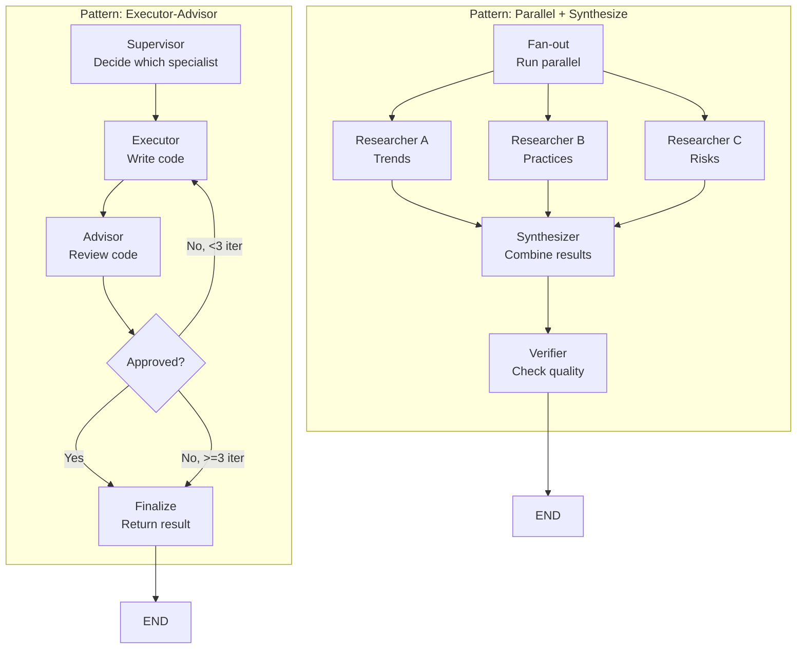

# Buổi 6 — Multi-Agent Engineering

> Phần I — Masterclass Agent Engineering · 2 giờ · Buổi 6/20
>
> Câu hỏi trung tâm: **Khi nào một agent không đủ, và làm sao phối hợp nhiều agent?**

## 0. Tổng quan

| Hạng mục           | Nội dung                                                                                                 |
| ------------------ | -------------------------------------------------------------------------------------------------------- |
| Đầu vào            | Hoàn thành Buổi 1–5, hiểu agent loop, context, tools, retrieval                                          |
| Đầu ra             | Multi-agent workflow có parallel execution, timeout, conflict resolution và cost tracking                |
| Công cụ            | LangGraph (subgraph), asyncio, Anthropic SDK, Python 3.11+                                               |
| Project xuyên suốt | Nâng cấp Operations Intelligence Agent: thêm Executor-Advisor pattern và Research Team parallel workflow |

### Mục tiêu học tập (đo được)

Sau buổi học, học viên có thể:

1. Phân loại khi nào **một agent là đủ** vs khi nào **cần multiple agents**, dùng checklist cụ thể.
2. Thiết kế delegation contract cho subagent: objective, context, constraints, expected output, evidence requirement, timeout.
3. Implement 3 patterns: **Supervisor** (một agent quyết định, delegate cho specialist), **Executor-Advisor** (một agent thực thi, một kiểm chứng), **Parallel specialists** (N agent chạy song song, synthesizer gộp).
4. Quản lý **fan-out / fan-in**: gửi task song song, gom kết quả, xử lý partial failure.
5. Resolve conflict giữa outputs: so sánh confidence, evidence, source priority; dùng verifier để quyết định.
6. Tính cost của multi-agent workflow: token budget per agent, max concurrent, early termination nếu vượt.
7. Debug subagent failure: trace, timeout, context leakage giữa agents.

### Phân bổ thời gian

| Block     | Thời lượng | Nội dung                                                              |
| --------- | ---------- | --------------------------------------------------------------------- |
| Concept   | 20 phút    | Khi nào dùng multi-agent; 7 patterns; delegation contract             |
| Deep dive | 30 phút    | Parallel execution; conflict resolution; cost model; failure modes    |
| Demo      | 15 phút    | Instructor xây Executor-Advisor pattern từ đầu với LangGraph subgraph |
| Lab       | 45 phút    | Học viên xây 2 workflows: Executor-Advisor + Research Team            |
| Review    | 10 phút    | So sánh kết quả, chốt cost tracking, debug checklist                  |

---

## 1. Theory — Khi nào dùng Multi-Agent (20 phút)

### 1.1 Single agent vs multi-agent: decision tree

Nhấn mạnh: **đa agent không phải luôn tốt hơn**. Nó tốn chi phí, tăng latency, khó debug. Chỉ dùng khi bài toán thực sự cần.

**Checklist quyết định:**

| Câu hỏi                                               | Nếu "có" →                         | Giải thích                               |
| ----------------------------------------------------- | ---------------------------------- | ---------------------------------------- |
| Task có thể chia thành các subtask **độc lập** không? | Multi-agent có ích                 | Có thể chạy song song, fan-out/fan-in    |
| Các subtask cần **skill khác nhau** không?            | Specialist agents                  | Research agent khác Research QA agent    |
| Có cần **human approval** ở điểm rủi ro không?        | Thêm Advisor agent                 | Executor chạy, Advisor kiểm chứng        |
| Kết quả của task N là input của task N+1 không?       | Workflow cố định hoặc serial chain | Chứ không phải parallel specialist       |
| Có cần **verify/debate** kết quả không?               | Thêm Verifier/Critic agent         | 2 agent tạo output rồi compare           |
| Total latency budget < 5s không?                      | **Tránh multi-agent**              | Parallel agent tốn latency + queue delay |
| Token budget <= 100k total không?                     | **Cẩn thận**                       | Mỗi agent gửi context, cộng lại dễ vượt  |

**Quy tắc thực hành:**

- Bắt đầu 1 agent → nếu fail/tệ → thêm specialist.
- Nếu multi-agent, phải có reason rõ ràng (parallelization hoặc expertise).
- Chi phí & latency phải rõ ràng trước khi thiết kế.

### 1.2 Bảy pattern multi-agent phổ biến

| Pattern                  | Mô tả                                                | Dùng khi                                                   | Ví dụ                                                          |
| ------------------------ | ---------------------------------------------------- | ---------------------------------------------------------- | -------------------------------------------------------------- |
| **Supervisor**           | 1 agent chọn tool/specialist, delegate task          | Task định tuyến: request phân loại → chuyên gia xử lý      | "Ticket này là bug hay feature?" → giao Resolver agent         |
| **Router**               | LLM/rule phân loại, gọi handler tương ứng            | Input có nhiều loại rõ ràng                                | Request tiếng Việt → TranslatorAgent; tiếng Anh → EnglishAgent |
| **Handoff**              | Agent A làm xong, chuyển state cho Agent B           | Sequential processing với context pass                     | Analyzer xong → Reporter nhận kết quả → Formatter              |
| **Subagent-as-tool**     | Agent B là một tool của Agent A                      | Agent A gọi "research(question)" mà không biết đó là agent | Executor agent gọi "verify_result()" → gọi Verifier subagent   |
| **Pipeline**             | N agents chạy tuần tự, output A = input B            | Workflow cố định: extract → validate → enrich → store      | Extract from doc → Validate schema → Save to DB                |
| **Parallel specialists** | N agents chạy **song song** độc lập, synthesizer gộp | Multi-perspective cần: 3 researchers, 1 synthesizer        | Research từ 3 sources khác nhau → Synthesizer gộp              |
| **Debate/Critic**        | 2 agents tạo output khác nhau, Verifier chọn         | Kết quả không rõ ràng, cần nhiều góc nhìn                  | Agent A + B đề xuất solution → Critic chọn tốt hơn             |

### 1.3 Delegation contract: 6 thành phần

Mỗi task gửi cho subagent phải định rõ:

```python
class DelegationContract(TypedDict):
    objective: str              # "Viết unit test cho hàm X"
    context: dict              # {"file": "utils.py", "function_source": "..."}
    constraints: list[str]     # ["Max 5 phút", "Chỉ dùng framework pytest"]
    expected_output: dict      # {"type": "list[test_case]", "format": "pytest code"}
    evidence_requirement: str   # "Mỗi test phải có assertion và docstring"
    timeout_seconds: int       # 300
```

**Đặc biệt:**

- **Objective**: rõ ràng, đo được. Không "tìm thông tin" mà "tìm pricing của Qdrant cloud tier 3".
- **Context**: đủ để subagent hiểu. Nếu thiếu → subagent phải hỏi → tốn thời gian. Nếu thừa → context size phình.
- **Constraints**: explicit. "Chỉ dùng database production, không được test data" rõ ràng hơn "cẩn thận với dữ liệu".
- **Expected output**: contract, không mô tả. Schema, format, metadata. Subagent phải trả đúng schema này.
- **Evidence**: ghi cách kiểm chứng. "Mỗi test phải pass" vs "pass + coverage >= 80%".
- **Timeout**: deadline cứng. Nếu quá → cancel, escalate.

---

## 2. Deep dive — Parallel Execution & Conflict Resolution (30 phút)

### 2.1 Fan-out / Fan-in execution model

```text
             Supervisor Agent
                   │
         ┌─────────┼─────────┐
         │         │         │
    Task_A    Task_B    Task_C  (fan-out: 3 agents song song)
    (5s)      (8s)      (3s)
         │         │         │
         └─────────┼─────────┘
                   │
        Gather Results (fan-in)
                   │
        Resolve Conflict / Merge
                   │
              Final Output
```

**Timing**: chờ `max(5, 8, 3) = 8s` chứ không phải `5+8+3 = 16s`. Tiết kiệm latency nhưng cần async.

**Implementation pattern (LangGraph):**

```python
import asyncio
from langgraph.graph import StateGraph

class MultiAgentState(TypedDict):
    task: str
    results: Annotated[list[dict], add]  # append results từ các agent
    conflicts: Annotated[list[str], add]  # lưu conflict nếu có
    final_result: dict
    latency_ms: int

async def specialist_a(state: MultiAgentState) -> dict:
    # Agent A chạy riêng, async
    result = await delegate_to_agent("Agent A", state["task"])
    return {"results": [{"source": "A", "output": result}]}

async def specialist_b(state: MultiAgentState) -> dict:
    result = await delegate_to_agent("Agent B", state["task"])
    return {"results": [{"source": "B", "output": result}]}

def fan_out_node(state: MultiAgentState) -> dict:
    # Chạy A và B song song
    start_time = time.time()
    results = asyncio.run(asyncio.gather(
        specialist_a(state),
        specialist_b(state)
    ))
    elapsed = (time.time() - start_time) * 1000

    # Gộp results
    merged = {"results": [], "latency_ms": elapsed}
    for r in results:
        merged["results"].extend(r.get("results", []))
    return merged
```

### 2.2 Handling partial failure

**Scenario**: Agent A timeout, Agent B thành công, Agent C lỗi. Làm gì?

| Tình huống        | Xử lý                                 | Kết quả                      |
| ----------------- | ------------------------------------- | ---------------------------- |
| Tất cả thành công | Merge results                         | Final output                 |
| 1 fail, 2 pass    | Xài 2 kết quả, log lỗi của 1          | Partial success, có cảnh báo |
| 2 fail, 1 pass    | Có / Không / Escalate? → tùy contract | Policy rõ ràng               |
| Tất cả fail       | Escalate hoặc fallback                | Lỗi rõ ràng                  |

**Code:**

```python
def fan_in_node(state: MultiAgentState) -> dict:
    results = state.get("results", [])
    success_count = sum(1 for r in results if not r.get("error"))
    total_count = len(results)

    if success_count == total_count:
        return {"final_result": {"status": "success", "results": results}}
    elif success_count >= total_count * 0.5:  # > 50% pass
        return {"final_result": {"status": "partial", "results": results}}
    else:
        return {"final_result": {"status": "failed", "results": results},
                "error_message": f"Only {success_count}/{total_count} succeeded"}
```

### 2.3 Conflict resolution

Khi 2+ agents cho output **khác nhau**, phải quyết định cái nào đúng.

**Strategy 1: Evidence-based merge**

```python
def resolve_conflict(results: list[dict]) -> dict:
    """
    Merge khi có conflict, ưu tiên result có evidence nhiều nhất.
    """
    for result in results:
        if "evidence" in result:
            result["evidence_score"] = len(result["evidence"])
        else:
            result["evidence_score"] = 0

    # Sort by evidence_score giảm dần
    sorted_results = sorted(results, key=lambda x: x["evidence_score"], reverse=True)
    return {
        "chosen": sorted_results[0],
        "alternatives": sorted_results[1:],
        "reasoning": f"Chose result from {sorted_results[0].get('source')} (evidence: {sorted_results[0]['evidence_score']})"
    }
```

**Strategy 2: Source priority**

```python
SOURCE_PRIORITY = {
    "primary_research": 3,
    "secondary_research": 2,
    "internal_db": 4,  # DB luôn tin cậy nhất nếu có
}

def resolve_by_priority(results: list[dict]) -> dict:
    ranked = [(SOURCE_PRIORITY.get(r.get("source"), 0), r) for r in results]
    ranked.sort(reverse=True)
    return {"chosen": ranked[0][1], "reasoning": f"Source priority: {ranked[0][1].get('source')}"}
```

**Strategy 3: Critic/Verifier agent**

Gửi 2 output cho Verifier agent, nó chọn cái nào tốt hơn:

```python
async def critic_resolution(result_a: dict, result_b: dict) -> dict:
    prompt = f"""
    Đánh giá 2 kết quả:
    A: {result_a}
    B: {result_b}

    Cái nào chính xác hơn? Giải thích.
    """
    decision = await call_llm(prompt)
    return {"chosen": ("A" if decision.startswith("A") else "B"),
            "explanation": decision}
```

### 2.4 Cost model cho multi-agent

**Tính toán:**

```
Total Cost = Σ(Agent_i cost) + Infrastructure

Per-Agent Cost:
  = input_tokens * $X + output_tokens * $Y + tool_calls * $Z

Example (3 researchers parallel):
  Researcher A: 8k in + 2k out = 8*0.003 + 2*0.015 = 0.054 USD
  Researcher B: 7k in + 1.8k out = 7*0.003 + 1.8*0.015 = 0.048 USD
  Researcher C: 9k in + 2.2k out = 9*0.003 + 2.2*0.015 = 0.060 USD
  Synthesizer: 5k in + 1k out = 5*0.003 + 1*0.015 = 0.030 USD
  ─────────────────────────────────────────────────
  Total: 0.192 USD (single agent synthesizer alone: 0.030 USD)
  Overhead: 0.162 USD cho 3 researchers
```

**Cost control strategy:**

| Tactic                      | Implement                                               | Trade-off                              |
| --------------------------- | ------------------------------------------------------- | -------------------------------------- |
| Model selection             | Use `claude-sonnet` for specialist, `opus` cho verifier | Specialist thường cần model nhỏ hơn    |
| Token budget per agent      | `max_tokens=1024` cho agent thay vì 4096                | Output ngắn hơn, có thể thiếu chi tiết |
| Max concurrent agents       | Limit 3 parallel, không phải 10                         | Latency tăng nhưng cost cân bằng       |
| Early termination           | Nếu 2 agents đã đồng ý, kill agent 3                    | Risk: agent 3 có insight khác          |
| Compression before delegate | Summarize context trước gửi agent                       | Đánh đổi detail vs cost                |

### 2.5 Timeout & cancellation

**Pattern:**

```python
import asyncio

async def delegate_with_timeout(agent_name: str, task: str, timeout_sec: int = 30):
    try:
        result = await asyncio.wait_for(
            run_agent(agent_name, task),
            timeout=timeout_sec
        )
        return {"status": "success", "result": result}
    except asyncio.TimeoutError:
        return {"status": "timeout", "error": f"{agent_name} exceeded {timeout_sec}s"}
    except Exception as e:
        return {"status": "error", "error": str(e)}

# Fan-out với timeout
results = await asyncio.gather(
    delegate_with_timeout("Agent A", task, 20),
    delegate_with_timeout("Agent B", task, 20),
    delegate_with_timeout("Agent C", task, 20),
    return_exceptions=True
)
```

### 2.6 Context isolation giữa agents

**Rủi ro**: Agent A data leak qua context của Agent B.

**Mitigations:**

1. **Namespace state per agent**: Mỗi agent có `thread_id` riêng, checkpoint riêng.
2. **Filter context**: Chỉ gửi relevant info, không gửi toàn bộ history.
3. **Tenant ID**: Nếu multi-tenant, pass tenant_id rõ ràng vào delegation contract.

```python
def sanitize_context(state: dict, allowed_keys: list[str]) -> dict:
    """Lọc state, chỉ gửi những field cần thiết."""
    return {k: v for k, v in state.items() if k in allowed_keys}

# Gửi subagent
clean_state = sanitize_context(full_state,
                               allowed_keys=["task", "user_id", "tenant_id"])
result = await delegate_to_agent("Specialist", clean_state)
```

---

## 3. Demo — Instructor (15 phút)

**Mục tiêu**: Xây Executor-Advisor pattern từ đầu với LangGraph subgraph. Task: "Viết function parsing JSON, Executor viết code, Advisor kiểm chứng".

### Bước 1: Định nghĩa State

```python
from typing import TypedDict, Annotated
from operator import add

class ExecutorAdvisorState(TypedDict):
    task: str
    executor_code: str | None
    advisor_feedback: str | None
    final_code: str
    iteration: int
    approved: bool
```

### Bước 2: Executor agent (chính)

```python
from anthropic import Anthropic

client = Anthropic()

def executor_node(state: ExecutorAdvisorState) -> dict:
    """Executor viết code dựa trên task."""
    print(f"[Executor] Iteration {state['iteration']}")

    resp = client.messages.create(
        model="claude-sonnet-4-20250514",
        max_tokens=1024,
        system="Bạn là expert developer. Viết code Python sạch, có comment.",
        messages=[{
            "role": "user",
            "content": state["task"] +
                      ("\nFeedback từ reviewer: " + state.get("advisor_feedback", ""))
        }]
    )

    code = resp.content[0].text
    return {"executor_code": code, "iteration": state["iteration"] + 1}
```

### Bước 3: Advisor agent (verifier, subgraph)

```python
def advisor_node(state: ExecutorAdvisorState) -> dict:
    """Advisor review code, trả feedback."""
    print(f"[Advisor] Review iteration {state['iteration']}")

    resp = client.messages.create(
        model="claude-opus-4-1",  # Model mạnh hơn cho review
        max_tokens=512,
        system="Bạn là code reviewer chặt chẽ. Tìm bug, security issue, performance problem.",
        messages=[{
            "role": "user",
            "content": f"Review code này:\n{state['executor_code']}"
        }]
    )

    feedback = resp.content[0].text

    # Parsing: "looks good" = approved, "issue: ..." = feedback
    approved = "looks good" in feedback.lower()

    return {"advisor_feedback": feedback, "approved": approved}
```

### Bước 4: Routing & Build graph

```python
from langgraph.graph import StateGraph, END

def route_after_review(state: ExecutorAdvisorState) -> str:
    if state["approved"]:
        return "finalize"
    if state["iteration"] >= 3:
        return "finalize"
    return "executor"  # lặp

def finalize_node(state: ExecutorAdvisorState) -> dict:
    return {"final_code": state["executor_code"], "approved": state["approved"]}

graph = StateGraph(ExecutorAdvisorState)
graph.add_node("executor", executor_node)
graph.add_node("advisor", advisor_node)
graph.add_node("finalize", finalize_node)

graph.set_entry_point("executor")
graph.add_edge("executor", "advisor")
graph.add_conditional_edges("advisor", route_after_review, {
    "executor": "executor",
    "finalize": "finalize",
    END: END
})
graph.add_edge("finalize", END)

app = graph.compile()

# Chạy
initial = {
    "task": "Viết function parse_json_safe(s: str) -> dict, handle mọi edge case",
    "executor_code": None,
    "advisor_feedback": None,
    "final_code": None,
    "iteration": 0,
    "approved": False,
}

result = app.invoke(initial)
print(f"Final code:\n{result['final_code']}")
print(f"Approved: {result['approved']}")
```

**Điểm nhấn**: Executor-Advisor là pattern đơn giản nhất của multi-agent. Dễ mở rộng thành 3-way (Executor-Advisor-Fallback).

---

## 4. Lab — Xây 2 Workflows (45 phút)

### 4.1 Setup

```bash
pip install langgraph anthropic asyncio
```

### 4.2 Workflow 1: Executor-Advisor Pattern (25 phút)

**Mục tiêu**: Mở rộng demo ở 3. thành full workflow với cost tracking.

**Yêu cầu**:

1. State có field: `task`, `executor_code`, `advisor_feedback`, `final_code`, `iteration`, `approved`, `total_cost_usd`, `tokens_used`.
2. Executor node gọi Sonnet.
3. Advisor node gọi Opus (chặt chẽ hơn).
4. Track tokens per node.
5. Routing: pass (approved) → finalize, fail → retry hoặc escalate.
6. Max 3 lần retry.
7. Finalize node return `final_code` và cost report.

**Skeleton:**

````python
# lab_executor_advisor.py
import json, os, time
from typing import TypedDict, Literal, Annotated
from anthropic import Anthropic
from operator import add

client = Anthropic(api_key=os.getenv("ANTHROPIC_API_KEY"))

class ExecutorAdvisorState(TypedDict):
    task: str
    executor_code: str | None
    advisor_feedback: str | None
    final_code: str | None
    iteration: int
    approved: bool
    total_cost_usd: float
    tokens_used: Annotated[list[dict], add]  # history of token usage

# Token pricing (Sonnet 4, Opus 4)
PRICING = {
    "sonnet-input": 0.003,    # per 1K tokens
    "sonnet-output": 0.015,
    "opus-input": 0.015,
    "opus-output": 0.075,
}

def calculate_cost(model: str, input_tokens: int, output_tokens: int) -> float:
    model_key = "sonnet" if "sonnet" in model else "opus"
    cost = (input_tokens * PRICING[f"{model_key}-input"] +
            output_tokens * PRICING[f"{model_key}-output"]) / 1000
    return cost

def executor_node(state: ExecutorAdvisorState) -> dict:
    print(f"[Executor] Iteration {state['iteration']}")

    prompt = state["task"]
    if state.get("advisor_feedback"):
        prompt += f"\n\nFeedback từ reviewer:\n{state['advisor_feedback']}"

    resp = client.messages.create(
        model="claude-sonnet-4-20250514",
        max_tokens=1024,
        messages=[{"role": "user", "content": prompt}]
    )

    code = resp.content[0].text
    cost = calculate_cost("sonnet",
                         resp.usage.input_tokens,
                         resp.usage.output_tokens)

    return {
        "executor_code": code,
        "iteration": state["iteration"] + 1,
        "tokens_used": [{
            "node": "executor",
            "iter": state["iteration"],
            "model": "sonnet",
            "input": resp.usage.input_tokens,
            "output": resp.usage.output_tokens,
            "cost_usd": cost
        }],
        "total_cost_usd": state.get("total_cost_usd", 0) + cost
    }

def advisor_node(state: ExecutorAdvisorState) -> dict:
    print(f"[Advisor] Review iteration {state['iteration']}")

    resp = client.messages.create(
        model="claude-opus-4-1-20250805",
        max_tokens=512,
        system="You are a strict code reviewer. Find bugs, performance issues, security problems.",
        messages=[{
            "role": "user",
            "content": f"Review this code:\n```python\n{state['executor_code']}\n```"
        }]
    )

    feedback = resp.content[0].text
    approved = "looks good" in feedback.lower() or "approved" in feedback.lower()

    cost = calculate_cost("opus",
                         resp.usage.input_tokens,
                         resp.usage.output_tokens)

    return {
        "advisor_feedback": feedback,
        "approved": approved,
        "tokens_used": [{
            "node": "advisor",
            "iter": state["iteration"],
            "model": "opus",
            "input": resp.usage.input_tokens,
            "output": resp.usage.output_tokens,
            "cost_usd": cost
        }],
        "total_cost_usd": state.get("total_cost_usd", 0) + cost
    }

def route_after_review(state: ExecutorAdvisorState) -> str:
    if state["approved"]:
        return "finalize"
    if state["iteration"] >= 3:
        print("  → MAX ITERATIONS, escalate to finalize")
        return "finalize"
    return "executor"

def finalize_node(state: ExecutorAdvisorState) -> dict:
    print(f"[Finalize] Code approved={state['approved']}, cost=${state['total_cost_usd']:.4f}")
    return {"final_code": state["executor_code"]}

# Build graph (same as demo)
from langgraph.graph import StateGraph, END

graph = StateGraph(ExecutorAdvisorState)
graph.add_node("executor", executor_node)
graph.add_node("advisor", advisor_node)
graph.add_node("finalize", finalize_node)

graph.set_entry_point("executor")
graph.add_edge("executor", "advisor")
graph.add_conditional_edges("advisor", route_after_review)
graph.add_edge("finalize", END)

app = graph.compile()

if __name__ == "__main__":
    initial_state = {
        "task": "Write a Python function: def parse_csv_safe(csv_str: str) -> list[dict]. Must handle malformed input, return empty list if invalid.",
        "executor_code": None,
        "advisor_feedback": None,
        "final_code": None,
        "iteration": 0,
        "approved": False,
        "total_cost_usd": 0.0,
        "tokens_used": [],
    }

    print("=== Executor-Advisor Workflow ===")
    result = app.invoke(initial_state)

    print(f"\n=== Final Result ===")
    print(f"Code:\n{result['final_code'][:200]}...")
    print(f"Approved: {result['approved']}")
    print(f"Total cost: ${result['total_cost_usd']:.4f}")
    print(f"Iterations: {result['iteration']}")
    print(f"\nToken usage:")
    for usage in result["tokens_used"]:
        print(f"  {usage['node']} (iter {usage['iter']}): {usage['input']} in, {usage['output']} out, ${usage['cost_usd']:.4f}")
````

### 4.3 Workflow 2: Research Team (Parallel + Synthesize) (20 phút)

**Mục tiêu**: N researchers chạy song song, synthesizer gộp, verifier kiểm chứng.

**Yêu cầu**:

1. 3 parallel researchers, mỗi research một góc nhìn.
2. Synthesizer gộp kết quả, tìm consensus.
3. Verifier kiểm tra kết quả cuối (format, completeness, truth).
4. Track latency parallel vs sequential.
5. Xử lý partial failure: nếu 1 researcher fail, vẫn tiếp tục với 2.

**Skeleton:**

```python
# lab_research_team.py
import asyncio, json, time
from typing import TypedDict, Annotated
from anthropic import Anthropic
from operator import add

client = Anthropic(api_key=os.getenv("ANTHROPIC_API_KEY"))

class ResearchTeamState(TypedDict):
    research_topic: str
    research_results: Annotated[list[dict], add]  # {source, content, timestamp}
    synthesis: str | None
    verification_passed: bool
    latency_ms: int
    total_cost_usd: float

async def researcher_node_a(topic: str) -> dict:
    """Research từ góc nhìn A: Recent trends."""
    print("[Researcher A] Searching recent trends...")

    resp = client.messages.create(
        model="claude-sonnet-4-20250514",
        max_tokens=512,
        messages=[{
            "role": "user",
            "content": f"Research topic: {topic}. Focus: recent trends, what's new in 2025-2026?"
        }]
    )

    return {
        "source": "A_trends",
        "content": resp.content[0].text,
        "tokens": (resp.usage.input_tokens, resp.usage.output_tokens),
    }

async def researcher_node_b(topic: str) -> dict:
    """Research từ góc nhìn B: Best practices."""
    print("[Researcher B] Searching best practices...")

    resp = client.messages.create(
        model="claude-sonnet-4-20250514",
        max_tokens=512,
        messages=[{
            "role": "user",
            "content": f"Research topic: {topic}. Focus: best practices, what experts recommend?"
        }]
    )

    return {
        "source": "B_practices",
        "content": resp.content[0].text,
        "tokens": (resp.usage.input_tokens, resp.usage.output_tokens),
    }

async def researcher_node_c(topic: str) -> dict:
    """Research từ góc nhìn C: Risks/challenges."""
    print("[Researcher C] Searching challenges...")

    resp = client.messages.create(
        model="claude-sonnet-4-20250514",
        max_tokens=512,
        messages=[{
            "role": "user",
            "content": f"Research topic: {topic}. Focus: challenges, pitfalls, risks?"
        }]
    )

    return {
        "source": "C_risks",
        "content": resp.content[0].text,
        "tokens": (resp.usage.input_tokens, resp.usage.output_tokens),
    }

async def parallel_research(topic: str, timeout_sec: int = 30) -> tuple[list[dict], float]:
    """Run 3 researchers in parallel, return results + latency."""
    start_time = time.time()

    try:
        results = await asyncio.wait_for(
            asyncio.gather(
                researcher_node_a(topic),
                researcher_node_b(topic),
                researcher_node_c(topic),
                return_exceptions=True
            ),
            timeout=timeout_sec
        )
    except asyncio.TimeoutError:
        results = []

    elapsed_ms = (time.time() - start_time) * 1000

    # Handle exceptions
    clean_results = [r for r in results if not isinstance(r, Exception)]

    return clean_results, elapsed_ms

def synthesizer_node(state: ResearchTeamState) -> dict:
    """Gộp 3 research kết quả thành 1 synthesis."""
    print("[Synthesizer] Combining research...")

    combined = "\n".join([
        f"[{r['source']}]\n{r['content']}"
        for r in state["research_results"]
    ])

    resp = client.messages.create(
        model="claude-opus-4-1-20250805",
        max_tokens=1024,
        system="You are a synthesis expert. Combine 3 research perspectives into 1 coherent report.",
        messages=[{
            "role": "user",
            "content": f"Synthesize these 3 research reports:\n{combined}"
        }]
    )

    return {"synthesis": resp.content[0].text}

def verifier_node(state: ResearchTeamState) -> dict:
    """Verify synthesis: complete, accurate, well-structured."""
    print("[Verifier] Checking synthesis...")

    resp = client.messages.create(
        model="claude-opus-4-1-20250805",
        max_tokens=256,
        system="You are a quality verifier. Check: completeness, accuracy, structure. Answer YES/NO.",
        messages=[{
            "role": "user",
            "content": f"Is this synthesis complete and well-structured?\n{state['synthesis']}"
        }]
    )

    verified = "yes" in resp.content[0].text.lower()
    return {"verification_passed": verified}

async def run_research_team(topic: str):
    """Orchestrate research team workflow."""
    print(f"\n=== Research Team Workflow ===")
    print(f"Topic: {topic}\n")

    # Step 1: Parallel research (fan-out)
    start = time.time()
    research_results, research_latency = await parallel_research(topic, timeout_sec=60)

    if not research_results:
        print("ERROR: All researchers failed")
        return

    print(f"✓ Parallel research: {len(research_results)}/3 completed in {research_latency:.0f}ms")

    # Step 2: Synthesize
    state = {
        "research_topic": topic,
        "research_results": research_results,
        "synthesis": None,
        "verification_passed": False,
        "latency_ms": research_latency,
        "total_cost_usd": 0.0,
    }

    synth_result = synthesizer_node(state)
    state["synthesis"] = synth_result["synthesis"]
    print("✓ Synthesis complete")

    # Step 3: Verify
    verify_result = verifier_node(state)
    state["verification_passed"] = verify_result["verification_passed"]

    print(f"✓ Verification: {'PASSED' if state['verification_passed'] else 'FAILED'}")
    print(f"\nSynthesis (first 300 chars):\n{state['synthesis'][:300]}...\n")

if __name__ == "__main__":
    topic = "Multi-agent systems in 2026: trends, best practices, and challenges"
    asyncio.run(run_research_team(topic))
```

### 4.4 Bước thực hiện Lab

| Bước                              | Việc làm                                                            | Kiểm tra                     |
| --------------------------------- | ------------------------------------------------------------------- | ---------------------------- |
| 1. Chạy Workflow 1                | `python lab_executor_advisor.py`                                    | Lặp 1-3 lần, track cost      |
| 2. Track cost                     | In cost breakdown per iteration                                     | Tổng cost < $0.20            |
| 3. Chạy Workflow 2                | `python lab_research_team.py`                                       | Parallel latency < 60s       |
| 4. So sánh sequential vs parallel | Tính: nếu chạy tuần tự 3 researcher (mỗi 10s) = 30s; parallel = 10s | Latency gain 3×              |
| 5. Test partial failure           | Thêm bug vào 1 researcher, chạy lại                                 | Vẫn hoạt động với 2 kết quả  |
| 6. Debug context leakage          | Print state trước/sau subagent                                      | Không có cross-contamination |

### 4.5 Thí nghiệm bắt buộc

#### A. Executor-Advisor: test all retry paths

```python
# Thay system prompt Advisor thành "Always reject"
# Kỳ vọng: executor retry 3 lần rồi finalize với approved=False
```

#### B. Research Team: one researcher timeout

```python
# Sửa researcher_node_c: time.sleep(60) trước response
# Kỳ vọng: timeout được catch, synthesis từ 2 kết quả
```

#### C. Cost tracking

```python
# Print tokens per iteration
# Tính tổng cost, so sánh Sonnet vs Opus input/output ratio
```

---

## 5. Output — Deliverables

### 5.1 Delegation contract template

```markdown
| Field           | Executor-Advisor                             | Research Team                              |
| --------------- | -------------------------------------------- | ------------------------------------------ |
| Objective       | "Write working Python code for task X"       | "Research topic Y and synthesize findings" |
| Context         | {task: "...", prev_feedback: "..."}          | {topic: "...", audience: "technical"}      |
| Constraints     | ["Max 1024 tokens", "Must include comments"] | ["Max 3 researchers", "Timeout 60s per"]   |
| Expected output | {"type": "code", "format": "python"}         | {"type": "report", "sections": 3}          |
| Evidence        | "Code must pass `python -m py_compile`"      | "Each section has >=3 sources"             |
| Timeout         | 30s per agent                                | 60s parallel                               |
```

### 5.2 Cost report

```
=== Cost Breakdown ===
Workflow: Executor-Advisor

Executor (Iteration 1):
  Input:  1,200 tokens × $0.003 = $0.0036
  Output: 350 tokens × $0.015 = $0.0053
  Subtotal: $0.0089

Advisor (Iteration 1):
  Input:  1,800 tokens × $0.015 = $0.027
  Output: 200 tokens × $0.075 = $0.015
  Subtotal: $0.042

[... repeat for iter 2, 3 ...]

─────────────────
Total: $0.156 (3 iterations)
Per-iteration average: $0.052
```

### 5.3 Latency comparison

```
Parallel Research Team:
  Sequential: Researcher A (10s) + B (8s) + C (12s) = 30s
  Parallel: max(10, 8, 12) = 12s
  Speedup: 2.5×

With overhead (queue + synthesizer):
  Actual: 15s
  Still 2× faster than sequential
```

### 5.4 Multi-agent architecture diagram

Mermaid:



---

## 6. Review (10 phút)

- 2–3 học viên trình bày: "Tại sao chọn Executor-Advisor vs Research Team?"
- Thảo luận: "Nếu tăng tên 5 researchers, cost tăng bao nhiêu, latency tăng bao nhiêu?"
- Chốt: Multi-agent là phương sách costly, chỉ dùng khi parallelization hay expertise separation có lợi rõ.

### Câu hỏi kiểm tra cuối buổi

1. Khi nào **không nên** dùng multi-agent?
2. Delegation contract gồm những field nào? Mỗi field quan trọng như thế nào?
3. Fan-out / Fan-in pattern là gì? Tính latency parallel 3 agent vs sequential.
4. Nếu 2 agents cho output khác nhau, 3 cách resolve là gì?
5. Cost multi-agent = ? Liệt kê tối thiểu 3 tactic để giảm cost.
6. Timeout exception trong parallel context nên xử lý thế nào?

### Theo 4 câu hỏi của khóa

| Câu hỏi   | Trả lời cho Buổi 6                                                                                                                                                       |
| --------- | ------------------------------------------------------------------------------------------------------------------------------------------------------------------------ |
| Why?      | Một agent đôi khi không xử lý được: task quá phức tạp, cần expertise khác nhau, hoặc cần parallel perspective. Multi-agent giải quyết bằng cách delegate và orchestrate. |
| How?      | Delegation contract + async fan-out/fan-in + conflict resolution + timeout handling + cost tracking. LangGraph subgraph hay async.gather.                                |
| Failure?  | Context leakage, timeout, partial failure, conflict mà không resolve, cost vượt budget, latency tăng quá.                                                                |
| Evidence? | Trace subagent calls, cost breakdown per agent, latency comparison (parallel vs sequential), partial failure rate, conflict rate.                                        |

---

## 7. Chuẩn bị cho Buổi 7

- Đọc về observability: logs, metrics, traces, span.
- Cài Langfuse (nếu chưa): `pip install langfuse`.
- Nghĩ: "Làm sao biết multi-agent workflow đang fail ở đâu?" → cần trace, observability.
- Bài tập về nhà: thêm Langfuse instrumentation vào một trong hai workflow ở Lab, track latency từng node.

## 8. Tài liệu tham khảo

- [LangGraph — Subgraph / Nested graphs](https://docs.langchain.com/oss/python/langgraph/concepts/): Orchestrate multi-agent.
- [Anthropic — Agents for Agentic Workflows](https://www.anthropic.com/research): Multi-agent patterns.
- [Async Python Pattern: asyncio.gather with timeout](https://docs.python.org/3/library/asyncio-task.html#asyncio.gather): Fan-out/fan-in.
- [Multi-Agent System Design Patterns (arXiv:2309.15025)](https://arxiv.org/html/2309.15025): Academic survey.
- [LangGraph Documentation: Human-in-the-loop](https://docs.langchain.com/oss/python/langgraph/how-tos/): Interrupt, resume with subagent.
- [Designing Production-Grade Multi-Agent Systems](https://www.linkedin.com/pulse/designing-production-grade-multi-agent-systems-cost-efficiency-xyz): Cost optimization.
- [Parallel Execution in LangGraph](https://github.com/langchain-ai/langgraph/discussions): Community examples.
